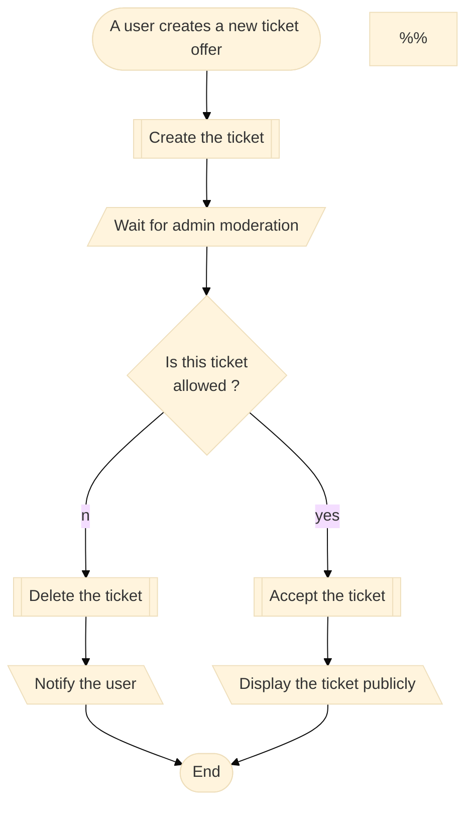
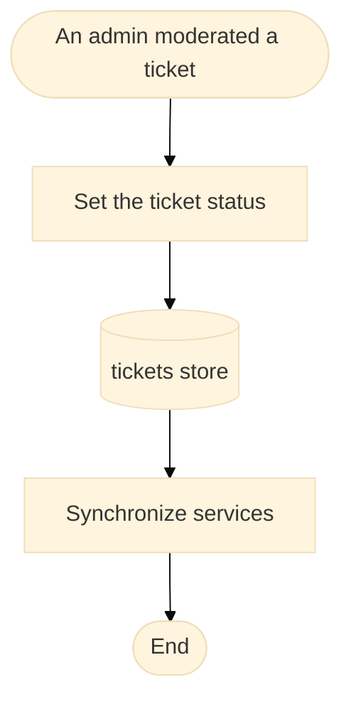

# Backend challenge

## Goal

In the ticketing app, we want to add a new functionality that would allow to moderate tickets before publishing them.
In other words, the tickets should only become public | visible once they have been validated.

### User story

`As an administrator, I want to ensure that a ticket does not contain illegal content before it’s published.`

### Flow

* * *
