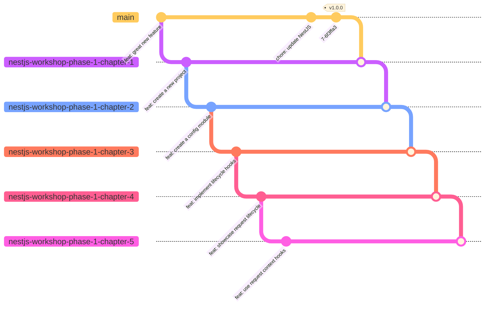

# NestJS Challenges

The [ticketing repository](https://github.com/getlarge/ticketing) contains challenges to help you learn NestJS by practicing. The challenges are designed to help you understand the principles of NestJS and how to apply them in a real-world scenario.

- [Chapter 1: Introduction to NestJS](./exercises/1-introduction-to-nestjs/README.md)
- [Chapter 2: Design and implement a hybrid application](./exercises/2-design-and-implement-a-hybrid-application/README.md)
- [Chapter 3: Advanced techniques](./exercises/3-advanced-techniques/README.md)

## Exercises organization

> [!IMPORTANT]
> The exercises are organized in chapters. Each chapter contains a set of exercises that build on top of each other. To resolve an exercise, create a new branch and submit a PR with the solution.
