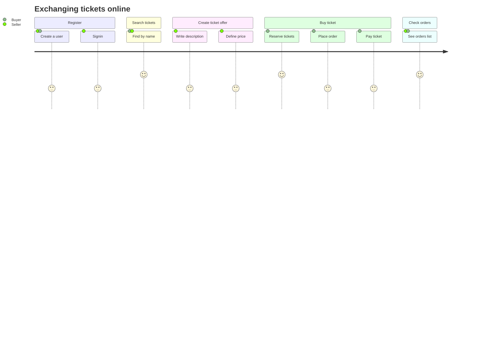
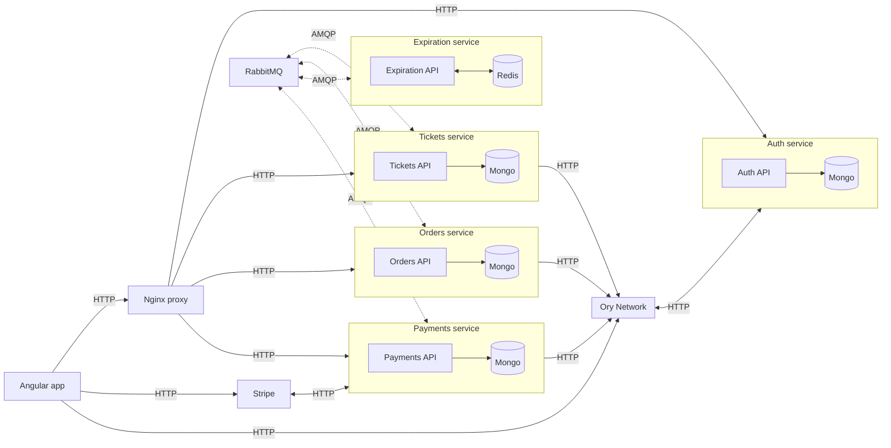
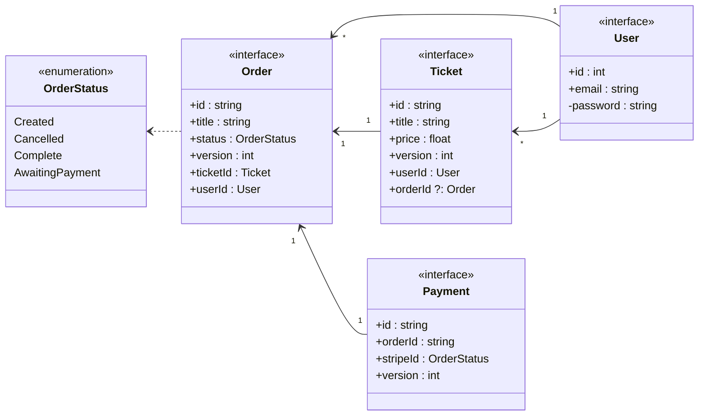
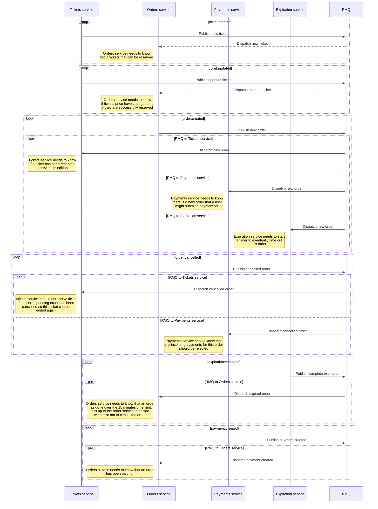

# Ticketing (think concert tickets)

This is a remix of the app built in the course [microservices with node.js and react](https://www.udemy.com/course/microservices-with-node-js-and-react/) starting at chapter 5.
Source code for the course can be found [here](https://github.com/StephenGrider/ticketing).

This repository shows:

- another way to manage shared/common modules (with [Nx](https://nx.dev))
- tricks to use [Fastify](https://fastify.dev) with [NestJS](https://nestjs.com)
- tricks to consume and produce ES6 modules with NestJS (and Nx)
- how to integrate [Ory network](https://ory.sh) in NestJS and Angular apps for authentication and authorization flows
- how to setup Ory in local and remote working environments
- how to use [RabbitMQ](https://www.rabbitmq.com) with NestJS
- how to define/validate environment variables
- how to containerize Nx apps with [Docker](https://www.docker.com)
- how to integrate Nx into a [Kubernetes](https://kubernetes.io) workflow
- how to dynamically rebuild Docker images based on Nx dependencies graph

## User story



## Architecture



## Models



## Events



## Useful commands

... to run after configuring the required environment variables

```bash
# build custom Nginx Proxy
yarn docker:nginx:build

# build custom RabbitMQ node
yarn docker:rmq:build

# start the docker images (mongo, redis, rabbitmq)
yarn docker:deps:up

# start Nginx Proxy
yarn docker:proxy:up

# start backend services
yarn start:backend

# start (Angular) frontend app
yarn start:frontend:local

```
