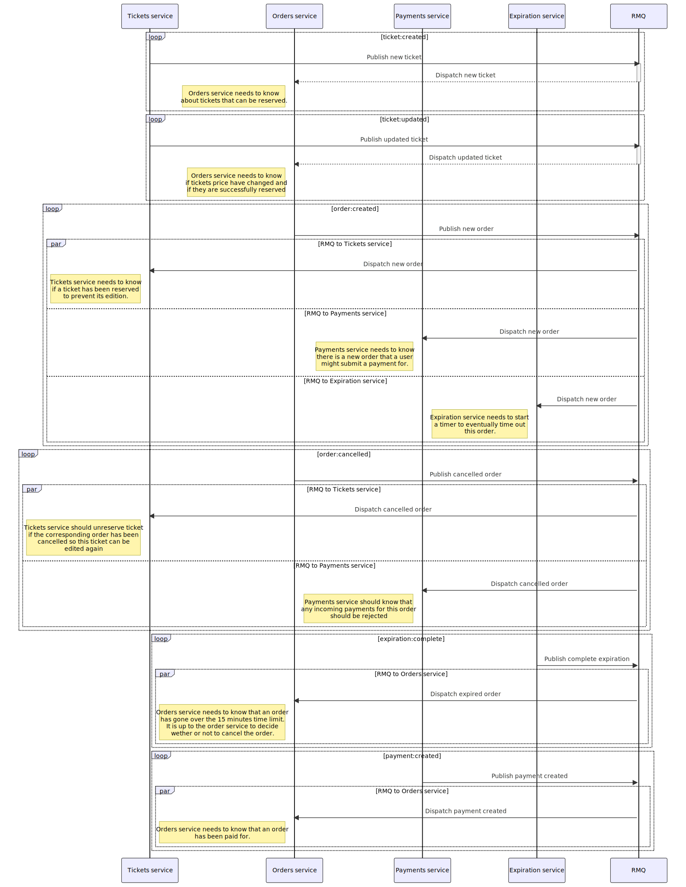

# Ticketing (think concert tickets)

This is a remix of the app built in the course [microservices with node.js and react](https://www.udemy.com/course/microservices-with-node-js-and-react/) starting at chapter 5.
Source code for the course can be found [here](https://github.com/StephenGrider/ticketing).

This repository shows

- another way to manage shared/common modules (with Nx)
- tricks to use Fastify with NestJS
- how to use NATS (streaming-server) with NestJS
- how to define/validate environment variables
- how to Dockerize Nx apps
- how to integrate Nx into a Kubernetes workflow
- how to dynamically rebuild docker images based on Nx dependencies graph

## User story


## Architecture



## Models



## Events



## Useful commands

... to run after configuring the required environment variables

```bash
# build custom Nginx Proxy
yarn docker:nginx:build

# build custom NATS Streaming Server
yarn docker:nats:build

# start the docker images (mongo, redis, nats)
yarn docker:deps:up

# start Nginx Proxy
yarn docker:proxy:up

# start backend services
yarn start:backend

# start (Angular) frontend app
yarn start:frontend:local

```
