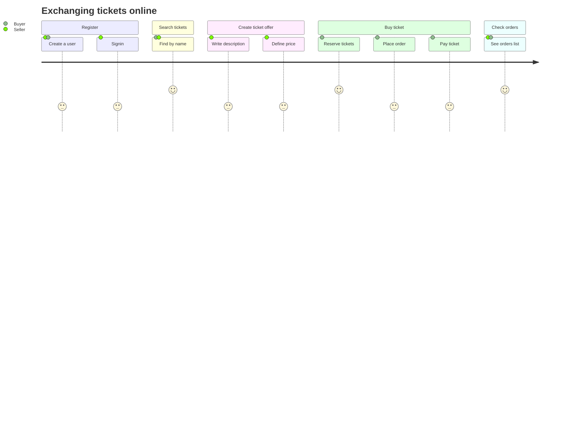
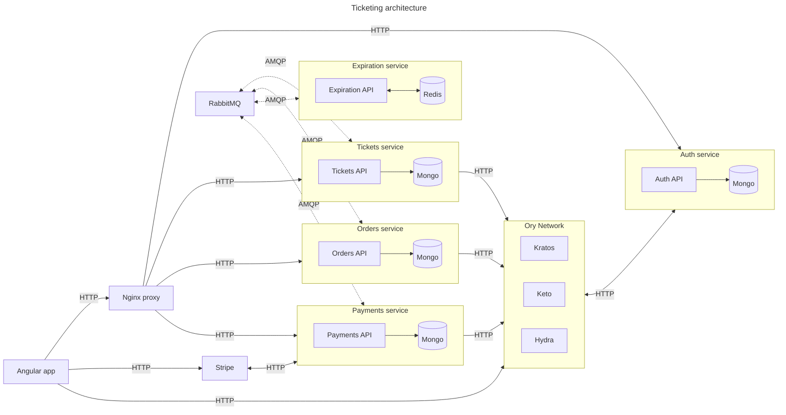
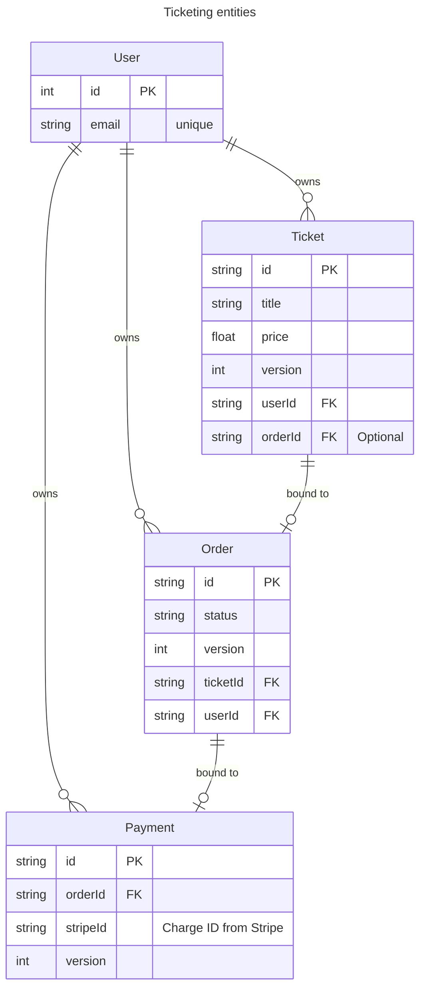
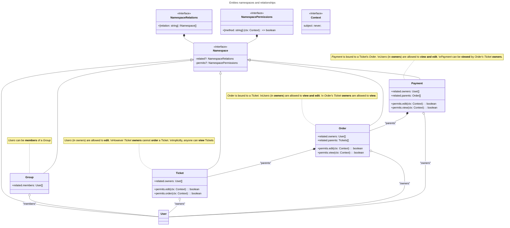
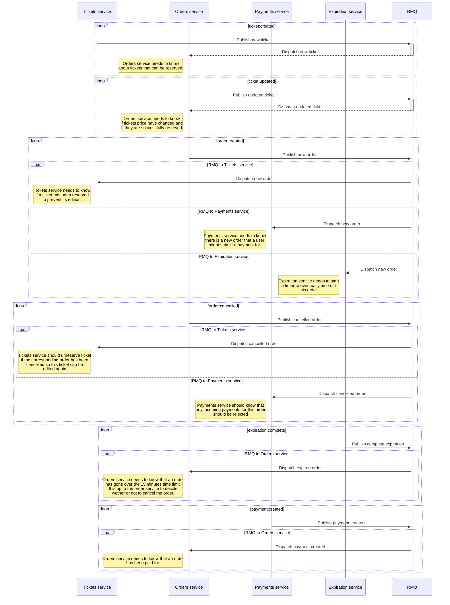

# Ticketing (think concert tickets)

📚 This repository is a learning resource for building a full-stack application with [Nx](https://nx.dev), [NestJS](https://nestjs.com), [Angular](https://angular.dev), and [Ory](https://ory.sh).

It shows:

- how to organize internal dependencies
- tricks to use [Fastify](https://fastify.dev) with `NestJS`
- tricks to consume and produce ES6 modules with `NestJS`, `Jest` and `Nx`
- how to integrate `Ory` in `NestJS` and `Angular` apps for authentication and authorization flows
- how to set up `Ory` in local and remote working environments
- how to use [RabbitMQ](https://www.rabbitmq.com) with `NestJS`
- how to define/validate environment variables
- how to containerize Nx apps with [Docker](https://www.docker.com)
- how to integrate Nx into a [Kubernetes](https://kubernetes.io) workflow
- how to dynamically rebuild `Docker` images based on the `Nx` project graph

And there is even a list of [challenges](./CHALLENGES.md)! 🏁

> [!NOTE]
> This project is inspired by Stephen Grider's [Microservices with Node JS and React](https://www.udemy.com/course/microservices-with-node-js-and-react/) course on Udemy, starting in chapter 5.
> You can find the source code for the course [here](https://github.com/StephenGrider/ticketing).

## User story



## Architecture



## Entities



## Permissions

Permissions are granted or denied using Ory Permissions (Keto) [policies](https://www.ory.sh/docs/keto/).



## Events



## Environment variables

I am using [dotenv-vault](https://vault.dotenv.org/) to manage environment variables.
You can fork the project and use the following links to create your Dotenv project by forking the corresponding Dotenv project.

| project                                    | fork                                                                                                                                                                              |
| ------------------------------------------ | --------------------------------------------------------------------------------------------------------------------------------------------------------------------------------- |
| [docker](./.env.vault)                     | [](https://vault.dotenv.org/project/prj_7dc625e23d6655d88f5fc340b5118f4f645cfe8b150522df15202cfe7390f9ad/example) |
| [auth](./apps/auth/.env.vault)             | [](https://vault.dotenv.org/project/prj_04b3110a437ffb0447545472cbc5a24cb10a00175f184291e0f87e3d3713b156/example) |
| [expiration](./apps/expiration/.env.vault) | [](https://vault.dotenv.org/project/prj_d12d931099f7e9b4188b46de1b2a6f3e05d6eb84df4cf153bd99fc56b724bf17/example) |
| [moderation](./apps/moderation/.env.vault) | [](https://vault.dotenv.org/project/vlt_a873660ea5f4c049dab8f0c5900682319d22dbafdb16523a8fece8fa32c30f58/example) |
| [orders](./apps/orders/.env.vault)         | [](https://vault.dotenv.org/project/prj_d9f6776d63a2f5a2f5344e560b46d73682de9609903b0008854038df27a57663/example) |
| [payments](./apps/payments/.env.vault)     | [](https://vault.dotenv.org/project/prj_f06df46b19ae0475561401ec975eae4971efba53f4882716572b79016fd4127d/example) |
| [tickets](./apps/tickets/.env.vault)       | [](https://vault.dotenv.org/project/prj_2ab6048cf86dd07e93a4eb095220e88b7428731454962e0f7ad9eb51fde7e2cc/example) |

## Useful commands

... to run after configuring the required environment variables

```bash
# build custom Nginx Proxy
yarn docker:proxy:build

# build custom RabbitMQ node
yarn docker:rmq:build

# start the Storage and Broker dependencies (mongo, redis, rabbitmq)
yarn docker:deps:up

# start Nginx Proxy (for backend services and frontend app)
yarn docker:proxy:up

# Generate Ory network configuration from .env
yarn ory:generate:kratos
yarn ory:generate:keto

# start Ory network (Kratos and Keto with database migrations)
yarn docker:ory:up

# start backend services
yarn start:backend

# start (Angular) frontend app
yarn start:frontend:local

```
