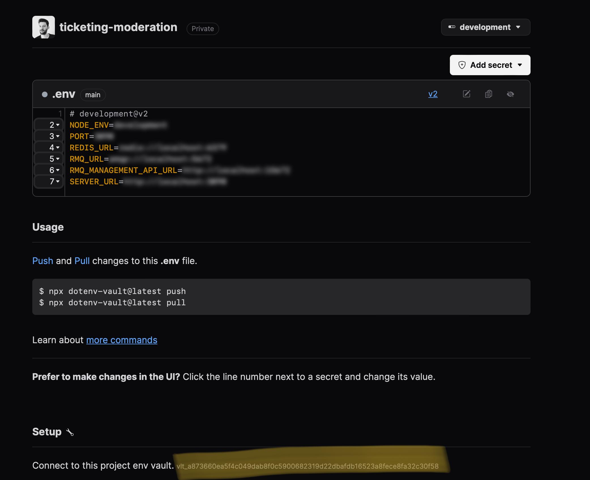
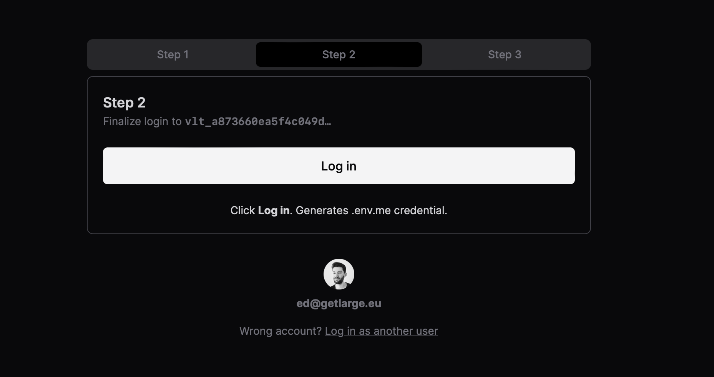
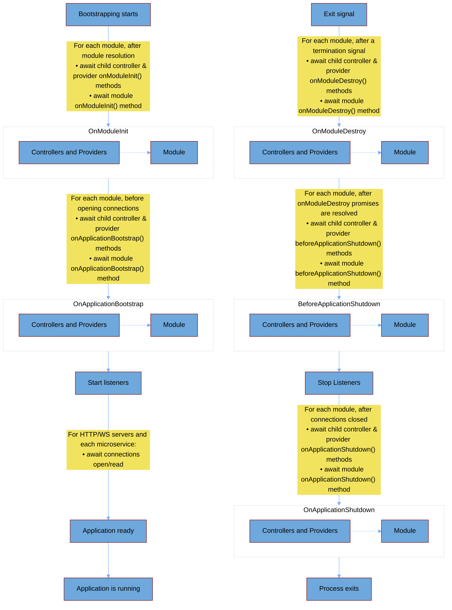
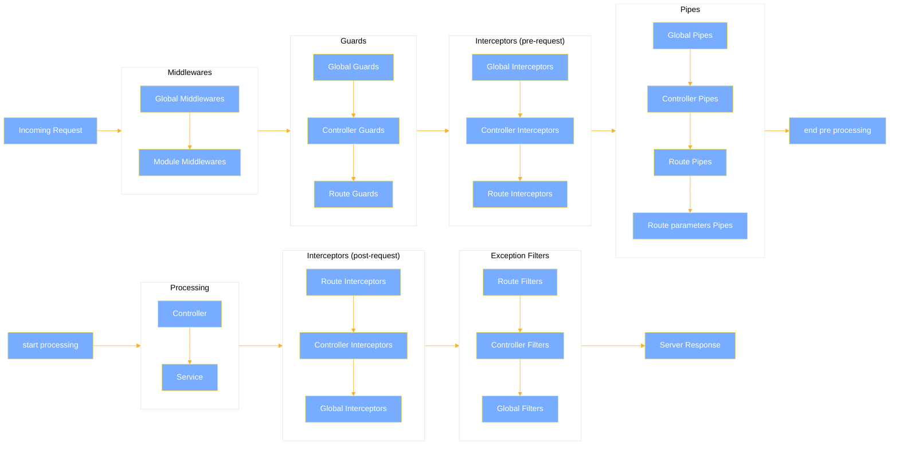

# 1 INTRODUCTION TO NESTJS

- [Introduction to NestJS](#introduction-to-nestjs)
  - [1. Create a NestJS application](#1-create-a-nestjs-application)
    - [1.1. Setup working environment](#11-setup-working-environment)
    - [1.2. Generate a new NestJS application](#12-generate-a-new-nestjs-application)
    - [1.3. Enable ESM modules](#13-enable-esm-modules)
      - [1.3.1. Create a custom Webpack configuration](#131-create-a-custom-webpack-configuration)
      - [1.3.2. Update TypeScript configuration](#132-update-typescript-configuration)
      - [1.3.3. Update Nx project configuration](#133-update-nx-project-configuration)
    - [1.4. Bootstrap NestJS Fastify application](#14-bootstrap-nestjs-fastify-application)
  - [2. Application configuration](#2-application-configuration)
    - [2.1. Environment variables](#21-environment-variables)
      - [2.1.1. Populate root .env file](#211-populate-root-env-file)
    - [2.2. Create shared environment variables class](#22-create-shared-environment-variables-class)
    - [2.3. Consuming environment variables](#23-consuming-environment-variables)
      - [2.3.1. Create an environment variables class](#231-create-an-environment-variables-class)
      - [2.3.2. Register configuration module](#232-register-configuration-module)
    - [2.4. Test setup](#24-test-setup)
    - [2.5. Share environment variables with Dotenv vault (optional)](#25-share-environment-variables-with-dotenv-vault-optional)
      - [2.5.1. Add Nx targets to moderation project](#251-add-nx-targets-to-moderation-project)
      - [2.5.2. Create an account on Dotenv](#252-create-an-account-on-dotenv)
      - [2.5.3. Setup Dotenv organization and first project (only once by team)](#253-setup-dotenv-organization-and-first-project-only-once-by-team)
      - [2.5.4. Prepare local setup](#254-prepare-local-setup)
        - [2.5.4.1. Connect](#2541-connect)
        - [2.5.4.2. Login](#2542-login)
        - [2.5.4.3. Sync](#2543-sync)
  - [3. NestJS Application Lifecycle](#3-nestjs-application-lifecycle)
    - [3.1. Implement lifecycle hooks](#31-implement-lifecycle-hooks)
      - [3.1.1. In a Module](#311-in-a-module)
      - [3.1.2. In a Controller](#312-in-a-controller)
      - [3.1.3. In a Provider](#313-in-a-provider)
    - [3.2. Enable shutdown hooks](#32-enable-shutdown-hooks)
    - [3.3. Test lifecycle hooks](#33-test-lifecycle-hooks)
  - [4. Request Lifecycle](#4-request-lifecycle)
    - [4.1. Middlewares](#41-middlewares)
      - [4.1.1 Global Middleware](#411-global-middleware)
      - [4.1.2 Module Middleware](#412-module-middleware)
    - [4.2. Guards](#42-guards)
      - [4.2.1 Global Guard](#421-global-guard)
      - [4.2.2 Controller Guard](#422-controller-guard)
      - [4.2.3 Route Guard](#423-route-guard)
    - [4.3. Interceptors](#43-interceptors)
      - [4.3.1 Global Interceptor](#431-global-interceptor)
      - [4.3.2 Controller Interceptor](#432-controller-interceptor)
      - [4.3.3 Route Interceptor](#433-route-interceptor)
    - [4.4. Pipes](#44-pipes)
      - [4.4.1. Global Pipe](#441-global-pipe)
      - [4.4.2. Controller Pipe](#442-controller-pipe)
      - [4.4.3. Route Pipe](#443-route-pipe)
      - [4.4.4. Route Parameters Pipe](#444-route-parameters-pipe)
    - [4.5. Exception Filters](#45-exception-filters)
      - [4.5.1. Global Exception Filter](#451-global-exception-filter)
      - [4.5.2. Controller Exception Filter](#452-controller-exception-filter)
      - [4.5.3. Route Exception Filter](#453-route-exception-filter)
    - [4.6. To sum it up](#46-to-sum-it-up)
    - [4.7. Test the request lifecycle](#47-test-the-request-lifecycle)
      - [4.7.1. Success request](#471-success-request)
      - [4.7.2. Exception request](#472-exception-request)
  - [5. Request context](#5-request-context)
    - [Different approaches](#different-approaches)
    - [5.1. Create an AsyncLocalStorage module](#51-create-an-asynclocalstorage-module)
      - [5.1.1. Generate NestJS library](#511-generate-nestjs-library)
      - [5.1.2. Create a provider](#512-create-a-provider)
      - [5.1.3. Create a module](#513-create-a-module)
    - [5.2. Propagate Request Context](#52-propagate-request-context)
      - [5.2.1. Create RequestContextMiddleware](#521-create-requestcontextmiddleware)
      - [5.2.2. Register AsyncLocalStorageModule and RequestContextMiddleware](#522-register-asynclocalstoragemodule-and-requestcontextmiddleware)
      - [5.2.3. Access request context in a NestJS controller](#523-access-request-context-in-a-nestjs-controller)
      - [5.2.4. Check the request context](#524-check-the-request-context)

# Introduction to NestJS

## 1. Create a NestJS application

<!-- region nestjs-workshop-phase-1-chapter-1 -->

### 1.1. Setup working environment

First, let's set up the working environment to ensure we have the correct Node.js version and project dependencies.

1. **Install Node Version Manager (NVM):**
   Use NVM to manage Node.js versions.

   ```bash
   curl -o- https://raw.githubusercontent.com/nvm-sh/nvm/v0.39.7/install.sh | bash
   ```

2. **Reload Shell Configuration and Verify Installation:**

   ```bash
   command -v nvm
   ```

3. **Install Node.js v18:**

   ```bash
   nvm use 18
   ```

4. **Fork the Project Repository:**
   Start by forking and cloning the project repository.

   ```bash
   gh repo fork getlarge/ticketing --clone
   ```

> **Note:**
> You can also use the [⑂ Fork button](https://github.com/getlarge/ticketing/fork) on the GitHub repository page to fork the project.

5. **Install Project Dependencies:**
   Navigate to the project directory and install dependencies using Yarn.

   ```bash
   cd ticketing
   yarn
   ```

### 1.2. Generate a new NestJS application

Next, we'll create a new NestJS application using the Nx plugin for NestJS.

1. **Generate a New Nx Project:**

   ```sh
   npx nx generate @nx/nest:app moderation --directory=apps/moderation --tags=scope:moderation,type:app,platform:server
   ```

2. **Remove Unnecessary Dependencies:**
   When generating a new NestJS application using Nx, the NestJS plugin automatically adds the `@nestjs/platform-express` package as a dependency. Since we will use Fastify instead of Express, we need to remove this dependency (`@nestjs/platform-fastify` should already be installed).

3. **Verify Project Structure:**
   Generate and inspect the project structure.

   ```sh
   tree apps/moderation
   ```

   **Expected Output:**

   ```sh
   apps/moderation
   ├── jest.config.ts
   ├── project.json
   ├── src
   │   ├── app
   │   │   ├── app.controller.spec.ts
   │   │   ├── app.controller.ts
   │   │   ├── app.module.ts
   │   │   ├── app.service.spec.ts
   │   │   └── app.service.ts
   │   ├── assets
   │   └── main.ts
   ├── tsconfig.app.json
   ├── tsconfig.json
   ├── tsconfig.spec.json
   └── webpack.config.js
   ```

### 1.3. Enable ESM modules

At the moment of writing (02/01/2024), a few adjustments are required to make NestJS work with Nx when using ESM modules.

#### 1.3.1. Create a custom Webpack configuration

Create a file `apps/moderation/webpack.config.cjs` with the following content:

<details>

```js
// apps/moderation/webpack.config.cjs
const { composePlugins, withNx } = require("@nx/webpack");
const nodeExternals = require("webpack-node-externals");

// workaround to load ESM modules in node
// @see https://github.com/nrwl/nx/pull/10414
// @see https://github.com/nrwl/nx/issues/7872#issuecomment-997460397

// Nx plugins for webpack.
module.exports = composePlugins(withNx(), (config) => {
  config.resolve.extensionAlias = {
    ...config.resolve.extensionAlias,
    ".js": [".ts", ".js"],
    ".mjs": [".mts", ".mjs"],
  };
  return {
    ...config,
    externalsPresets: {
      node: true,
    },
    output: {
      ...config.output,
      module: true,
      libraryTarget: "module",
      chunkFormat: "module",
      filename: "[name].mjs",
      chunkFilename: "[name].mjs",
      library: {
        type: "module",
      },
      environment: {
        module: true,
      },
    },
    experiments: {
      ...config.experiments,
      outputModule: true,
      topLevelAwait: true,
    },
    externals: nodeExternals({
      importType: "module",
    }),
  };
});
```

> **Note:**
> Please note the `.cjs` extension, which is required to load the configuration file as a CommonJS module.

</details>

#### 1.3.2. Update TypeScript configuration

To make TypeScript work with ESM, we need to update the `tsconfig.*.json` files.

Update the Typescript config for the application in `apps/moderation/tsconfig.app.json`:

<details>

```json
// apps/moderation/tsconfig.app.json
{
  "extends": "./tsconfig.json",
  "compilerOptions": {
    "outDir": "../../dist/out-tsc",
    "emitDecoratorMetadata": true,
    "moduleResolution": "Bundler",
    "module": "esnext",
    "target": "es2022",
    "types": ["node"]
  },
  "exclude": ["**/*.spec.ts", "**/*.e2e-spec.ts", "jest.config.ts"],
  "include": ["**/*.ts"]
}
```

</details>

Update the Typescript config for tests in `apps/moderation/tsconfig.spec.json`:

<details>

```json
// apps/moderation/tsconfig.spec.json
{
  "extends": "./tsconfig.json",
  "compilerOptions": {
    "outDir": "../../dist/out-tsc",
    "moduleResolution": "node",
    "module": "esnext",
    "target": "es2022",
    "emitDecoratorMetadata": true,
    "types": ["jest", "node"],
    "allowJs": true
  },
  "include": [
    "**/*.e2e-spec.ts",
    "**/*.mock.ts",
    "**/*.spec.ts",
    "**/*.d.ts",
    "jest.config.ts"
  ]
}
```

</details>

#### 1.3.3. Update Nx project configuration

In addition to the above changes, we need to update the project configuration to use the custom Webpack configuration.

<details>

Inside `apps/moderation/project.json`:

```json
// apps/moderation/project.json
{
  "name": "moderation",
  "$schema": "../../node_modules/nx/schemas/project-schema.json",
  "sourceRoot": "apps/moderation/src",
  "projectType": "application",
  "targets": {
    "build": {
      "executor": "@nx/webpack:webpack",
      "outputs": ["{options.outputPath}"],
      "defaultConfiguration": "production",
      "options": {
        "outputPath": "dist/apps/moderation",
        "outputFileName": "main.mjs",
        "main": "apps/moderation/src/main.ts",
        "tsConfig": "apps/moderation/tsconfig.app.json",
        "assets": ["apps/moderation/src/assets"],
        "generatePackageJson": true,
        "target": "node",
        "compiler": "tsc",
        "webpackConfig": "apps/moderation/webpack.config.cjs",
        "isolatedConfig": true
      },
      "configurations": {
        "development": {},
        "production": {}
      }
    },
    "serve": {
      "executor": "@nx/js:node",
      "defaultConfiguration": "local",
      "options": {
        "buildTarget": "moderation:build"
      },
      "configurations": {
        "development": {
          "buildTarget": "moderation:build:development"
        },
        "production": {
          "buildTarget": "moderation:build:production"
        },
        "local": {
          "buildTarget": "moderation:build:development"
        }
      }
    },
    "lint": {
      "executor": "@nx/eslint:lint",
      "outputs": ["{options.outputFile}"],
      "options": {
        "lintFilePatterns": ["apps/moderation/**/*.ts"]
      }
    },
    "test": {
      "executor": "@nx/jest:jest",
      "outputs": ["{workspaceRoot}/coverage/{projectRoot}"],
      "options": {
        "jestConfig": "apps/moderation/jest.config.ts"
      }
    }
  },
  "tags": ["scope:moderation", "type:app", "platform:server"]
}
```

</details>

### 1.4. Bootstrap NestJS Fastify application

Update the default `main.ts` file to bootstrap the NestJS application using Fastify.

<details>

```ts
// apps/moderation/src/main.ts
import { Logger } from "@nestjs/common";
import { NestFactory } from "@nestjs/core";
import {
  FastifyAdapter,
  NestFastifyApplication,
} from "@nestjs/platform-fastify";
import { GLOBAL_API_PREFIX } from "@ticketing/microservices/shared/constants";

import { AppModule } from "./app/app.module";

const DEFAULT_PORT = 3090;

async function bootstrap(): Promise<void> {
  const app = await NestFactory.create<NestFastifyApplication>(
    AppModule,
    new FastifyAdapter({
      trustProxy: true,
      bodyLimit: +process.env.MAX_PAYLOAD_SIZE || 1048576,
    }),
    { bufferLogs: true, abortOnError: false },
  );
  app.setGlobalPrefix(GLOBAL_API_PREFIX);

  const port = process.env.PORT ?? DEFAULT_PORT;

  await app.listen(port, "0.0.0.0", () => {
    Logger.log(`Listening at http://localhost:${port}/${GLOBAL_API_PREFIX}`);
  });
}

bootstrap().catch((error) => {
  console.error(error);
  process.exit(1);
});
```

> **Note:**
> By default, Fastify listens only on the localhost 127.0.0.1 interface, to accept connections on other hosts (such as local network IP address), you should specify '0.0.0.0'.

</details>

<!-- endregion -->

## 2. Application configuration

<!-- region nestjs-workshop-phase-1-chapter-2 -->

**How do you configure a NestJS application in a reliable and scalable way?**

The ConfigModule can receive a `validate` function in its parameters to validate environment variables at load time. Let’s make the best out of it; maybe we can make the best out of it?

### 2.1. Environment variables

#### 2.1.1. Populate root .env file

Create a `.env` file in the root of the project with the following content:

<details>
  <summary>.env</summary>

```sh
NODE_ENV=development
LOG_LEVEL=info
JWT_ALGORITHM=ES256
JWT_EXPIRES_IN=15m
JWT_ISSUER=localhost
JWT_PRIVATE_KEY=
JWT_PUBLIC_KEY=
SESSION_KEY=
STRIPE_PUBLISHABLE_KEY=
STRIPE_SECRET_KEY=
# NETWORK
PROXY_SERVER_URLS=http://localhost
FRONTEND_URL=http://localhost
FRONTEND=host.docker.internal
FRONTEND_PORT=4200
AUTH_SERVICE=host.docker.internal
AUTH_SERVICE_PORT=3000
ORDERS_SERVICE=host.docker.internal
ORDERS_SERVICE_PORT=3020
PAYMENTS_SERVICE=host.docker.internal
PAYMENTS_SERVICE_PORT=3040
TICKETS_SERVICE=host.docker.internal
TICKETS_SERVICE_PORT=3010
DOMAIN=localhost
CONNECT_SRC="http://localhost:4455 http://localhost:4433 http://localhost:4000 http://localhost:8080"
DEFAULT_SRC="http://localhost:4455 http://localhost:4433 http://localhost:4000 http://localhost:8080"
MEDIA_SRC=""
SCRIPT_SRC="'unsafe-inline'"
STYLE_SRC=""
STYLE_SRC_ELEM=""
STYLE_SRC_ATTR=""
FONT_SRC="data:"
FRAME_SRC="http://localhost:4455 http://localhost:4433 http://localhost:4000"
IMG_SRC=""
FORM_ACTION="http://localhost:8080"
# ORY
log_level="trace"
# ORY KRATOS
kratos_dsn="memory"
selfservice_default_browser_return_url="http://127.0.0.1:8080/"
selfservice_allowed_return_urls="http://127.0.0.1:8080, http://127.0.0.1:4455"
selfservice_flows_ui_base_url="http://127.0.0.1:4455"
selfservice_flows_errors_ui_url="http://127.0.0.1:4455/error"
selfservice_flows_settings_ui_url="http://127.0.0.1:4455/settings"
selfservice_flows_login_ui_url="http://127.0.0.1:4455/login"
selfservice_flows_registration_ui_url="http://127.0.0.1:4455/register"
selfservice_flows_recovery_ui_url="http://127.0.0.1:4455/recovery"
selfservice_flows_verification_ui_url="http://127.0.0.1:4455/verification"
selfservice_flows_login_after_hook_config_url="http://host.docker.internal:8080/api/users/on-sign-in"
selfservice_flows_login_after_hook_config_auth_config_value="unsecure_api_key"
selfservice_flows_login_after_hook_config_can_interrupt="false"
selfservice_flows_login_after_hook_config_response_ignore="false"
selfservice_flows_login_after_hook_config_response_parse="false"
selfservice_flows_registration_after_hook_config_url="http://host.docker.internal:8080/api/users/on-sign-up"
selfservice_flows_registration_after_hook_config_auth_config_value="unsecure_api_key"
selfservice_flows_registration_after_hook_config_can_interrupt="true"
selfservice_flows_registration_after_hook_config_response_ignore="false"
selfservice_flows_registration_after_hook_config_response_parse="true"
oauth2_provider_url="http://hydra:4445/"
secrets_cookie="cookie_secret_not_good_not_secure"
secrets_cipher="32-LONG-SECRET-NOT-SECURE-AT-ALL"
serve_admin_base_url="http://kratos:4434/"
serve_public_base_url="http://127.0.0.1:4433/"
serve_public_cors_enabled="true"
serve_public_cors_allowed_origins="http://127.0.0.1:4433, http://127.0.0.1:4455, http://127.0.0.1:8080"
# ORY KETO
keto_dsn="memory"
# ORY HYDRA
hydra_dsn="memory"
urls_self_issuer="http://127.0.0.1:4444"
urls_self_public="http://127.0.0.1:4444"
urls_consent="http://127.0.0.1:4455/consent"
urls_login="http://127.0.0.1:4455/login"
urls_logout="http://127.0.0.1.4455/logout"
urls_identity_provider_publicUrl="http://127.0.0.1:4433"
urls_identity_provider_url="http://kratos:4434"
secrets_system="system_secret_not_good_not_secure"
oidc_subject_identifiers_pairwise_salt="not_secure_salt"
oauth2_token_hook_url="http://host.docker.internal:8080/api/clients/on-token-request"
oauth2_token_hook_auth_config_value="unsecure_api_key"
```

</details>

### 2.2. Create shared environment variables class

Create a file in `libs/microservices/shared/env` named `my-api-environment-variables.ts`, with the following content and export the class in the `index.ts` file:

<details>

```ts
// libs/microservices/shared/env/src/my-api-environment-variables.ts
import { Expose } from "class-transformer";
import { IsOptional, IsString, IsUrl } from "class-validator";
import { decorate } from "ts-mixer";

export class MyApiEnvironmentVariables {
  @decorate(Expose())
  @decorate(
    IsUrl({
      require_protocol: true,
      require_valid_protocol: true,
      require_host: true,
      require_tld: false,
    }),
  )
  @decorate(IsOptional())
  MY_API_URL?: string = "http://localhost:3000";

  @decorate(Expose())
  @decorate(IsString())
  @decorate(IsOptional())
  MY_API_KEY?: string = null;
}
```

> **Note**:
>
> - The `decorate` function is used to allow decorators to be used and inherited in mixins. See [ts-mixer](https://github.com/tannerntannern/ts-mixer#mixing-with-decorators) for more details.
> - The `@Expose` decorator is used to expose the property when using the `plainToClass` method from `class-transformer`, with the option `excludeExtraneousValues`. See [class-transformer](https://github.com/typestack/class-transformer#enforcing-type-safe-instance) for more details.

</details>

### 2.3. Consuming environment variables

#### 2.3.1. Create an environment variables class

Create a file in `apps/moderation/src/app/env` with the following content:

<details>

```ts
// apps/moderation/src/app/env/index.ts
import { ConfigService } from "@nestjs/config";
import {
  BaseEnvironmentVariables,
  MyApiEnvironmentVariables,
} from "@ticketing/microservices/shared/env";
import { Exclude } from "class-transformer";
import { readFileSync } from "node:fs";
import { join } from "node:path";
import { Mixin } from "ts-mixer";

export type AppConfigService = ConfigService<EnvironmentVariables, true>;

export class EnvironmentVariables extends Mixin(
  BaseEnvironmentVariables,
  MyApiEnvironmentVariables,
) {
  @Exclude()
  private pkg: { [key: string]: unknown; name?: string; version?: string } =
    JSON.parse(readFileSync(join(process.cwd(), "package.json"), "utf8"));

  APP_NAME?: string = "moderation";

  APP_VERSION?: string = this.pkg?.version || "0.0.1";
}
```

> **Note**:
>
> - The `Mixin` function is used to allow multiple inheritance of classes. See [ts-mixer](https://github.com/tannerntannern/ts-mixer#overview).
> - The `@Exclude` decorator is used to exclude the property when using the `plainToClass` method from `class-transformer`.

</details>

#### 2.3.2. Register configuration module

We will now register the configuration module in the `AppModule` and use the `EnvironmentVariables` class to validate the environment variables.

<details>

```ts
// apps/moderation/src/app/app.module.ts
import { Module } from "@nestjs/common";
import { ConfigModule } from "@nestjs/config";
import { validate } from "@ticketing/microservices/shared/env";
import { resolve } from "node:path";

import { AppController } from "./app.controller";
import { AppService } from "./app.service";
import { EnvironmentVariables } from "./env";

@Module({
  imports: [
    ConfigModule.forRoot({
      // cache: true,
      isGlobal: true,
      envFilePath: resolve("apps/moderation/.env"),
      validate: validate(EnvironmentVariables),
    }),
  ],
  controllers: [AppController],
  providers: [AppService],
})
export class AppModule {}
```

> **Note**:
>
> - The `validate` function is used to validate the environment variables at load time. It receives the `EnvironmentVariables` class as a parameter and uses the `class-validator` and `class-transformer` libraries to validate the environment variables.
> - The `cache` option is set to `true` to enable caching of the environment variables, which can improve performance by reducing the number of file reads.
> - The `isGlobal` option is set to `true` to make the configuration module available to the entire application.

</details>

### 2.4. Test setup

After you have ensured that the environment variables are correctly set up for each project and docker containers (check the [examples](https://github.com/getlarge/ticketing?tab=readme-ov-file#environment-variables) if needed), you can run the following commands from the root of the project:

```bash
# build custom Nginx Proxy
yarn docker:proxy:build

# Generate Ory network configuration from .env
yarn ory:generate:kratos
yarn ory:generate:keto

# start the Storage and Broker dependencies (mongo, redis, rabbitmq)
yarn docker:deps:up

# start Ory network (Kratos and Keto with database)
yarn docker:ory:up

# start Nginx Proxy (for backend services and frontend app)
yarn docker:proxy:up
# or fox linux machines
yarn docker:proxy-linux:up

# start existing backend services in a single terminal
yarn start:backend
# or start existing backend services in separate terminals
npx nx serve auth
npx nx serve expiration
npx nx serve orders
npx nx serve payments
npx nx serve tickets
# finally start the moderation app
npx nx serve moderation
```

> **Note**:
>
> - When running docker commands from a Linux machine, you will need to uncomment the `extra_hosts` options in docker.compose.yaml.
> - If you use an older version of docker, replace calls to `docker compose` by `docker-compose` in `package.json` scripts.

### 2.5. Share environment variables with Dotenv vault (optional)

It is common to store environment variables in files when working locally while directly exporting them in the current process when deploying remotely.
Difficulties arise when you must share those with your coworkers or when a DevOps team member should change the remote environment variables.

[Dotenv vault](https://dotenv.org) provides a great solution that can be easily applied to your NestJS project.

#### 2.5.1. Add Nx targets to moderation project

First of all, to make our life easier, let's create some Nx targets in `apps/moderation/project.json`:

<details>

```json
// apps/moderation/project.json
{
  "name": "moderation",
  "$schema": "../../node_modules/nx/schemas/project-schema.json",
  "sourceRoot": "apps/moderation/src",
  "projectType": "application",
  "targets": {
    "build": {
      "executor": "@nx/webpack:webpack",
      "outputs": ["{options.outputPath}"],
      "defaultConfiguration": "production",
      "options": {
        "outputPath": "dist/apps/moderation",
        "outputFileName": "main.mjs",
        "main": "apps/moderation/src/main.ts",
        "tsConfig": "apps/moderation/tsconfig.app.json",
        "assets": ["apps/moderation/src/assets"],
        "generatePackageJson": true,
        "target": "node",
        "compiler": "tsc",
        "webpackConfig": "apps/moderation/webpack.config.cjs",
        "isolatedConfig": true
      },
      "configurations": {
        "development": {},
        "production": {}
      }
    },
    "serve": {
      "executor": "@nx/js:node",
      "defaultConfiguration": "local",
      "options": {
        "buildTarget": "moderation:build"
      },
      "configurations": {
        "development": {
          "buildTarget": "moderation:build:development"
        },
        "production": {
          "buildTarget": "moderation:build:production"
        },
        "local": {
          "buildTarget": "moderation:build:development"
        }
      }
    },
    "lint": {
      "executor": "@nx/eslint:lint",
      "outputs": ["{options.outputFile}"],
      "options": {
        "lintFilePatterns": ["apps/moderation/**/*.ts"]
      }
    },
    "test": {
      "executor": "@nx/jest:jest",
      "outputs": ["{workspaceRoot}/coverage/{projectRoot}"],
      "options": {
        "jestConfig": "apps/moderation/jest.config.ts"
      }
    },
    "dotenv-push": {
      "executor": "nx:run-commands",
      "options": {
        "commands": ["cd apps/moderation && dotenv-vault push"]
      },
      "cwd": ".",
      "parallel": false
    },
    "dotenv-pull": {
      "executor": "nx:run-commands",
      "options": {
        "commands": ["node tools/utils/dotenv-pull.js -p moderation -v"]
      },
      "parallel": false,
      "cwd": "."
    },
    "dotenv-build": {
      "executor": "nx:run-commands",
      "options": {
        "commands": ["cd apps/moderation && dotenv-vault build"]
      },
      "cwd": ".",
      "parallel": false
    },
    "dotenv-keys": {
      "executor": "nx:run-commands",
      "options": {
        "commands": ["cd apps/moderation && dotenv-vault keys"]
      },
      "cwd": ".",
      "parallel": false
    }
  },
  "tags": ["scope:moderation", "type:app", "platform:server"]
}
```

</details>

#### 2.5.2. Create an account on Dotenv

Create an account on [Dotenv](https://vault.dotenv.org/account/signup).

#### 2.5.3. Setup Dotenv organization and first project (only once by team)

1. Register your team on Dotenv and [create an organization](https://vault.dotenv.org/ui/ui1/organization/plan).
2. Invite your team members to the organization.
3. Create a project on Dotenv under your organization [here](https://vault.dotenv.org/ui/ui1/project/new).

#### 2.5.4. Prepare local setup

##### 2.5.4.1. Connect

Connect to the remote vault using the vault ID provided by Dotenv (starting with **vlt\_**).
This will create a `.env.vault` file in the `apps/moderation` folder.

<details>



```bash
cd apps/moderation
npx dotenv-vault new vlt_xxxxxx
cd -
```

</details>

##### 2.5.4.2. Login

Now, it's time to log in to Dotenv, this will create a `.env.me` file in the `apps/moderation` folder and allow you to push and pull environment variables (if you have the right permissions).

<details>



```bash
cd apps/moderation
npx dotenv-vault login
cd -
```

</details>

##### 2.5.4.3. Sync

Now, you can sync your local environment variables with the remote vault.

Let's start by pulling the remote environment variables to your local `.env` file.

```bash
cd apps/moderation
npx dotenv-vault pull
cd -

# which, unless you modified the default environment, implicitly runs :
npx dotenv-vault pull development .env
```

And then you can modify your local environment variables and push them to the remote vault.

```bash
echo -e "#.env \BONJOUR="MONDE" \n" >> apps/moderation/.env

cd apps/moderation
npx dotenv-vault push
cd -
```

<!-- endregion -->

## 3. NestJS Application Lifecycle

<!-- region nestjs-workshop-phase-1-chapter-3 -->

[Diagram](https://mermaid.live/edit#pako:eNqdVu1u2jAUfZUrTx2bBF0KpUB-TBq00wZlm0S1SSv9YZKbYinYke20ZVWlPcsebU-y65iW8NGVlh8hjs_1Oef63sS3LFIxspDt7d2OJYCQwoZQ3AJU7BRnWAmhMuEGK9Xy0-9cCz5J0VQe4DSVaTHjet5TqdIu7tVRwttxdB-6RJzhjV2igiDYhHSVjlEvQa1esIpLhcTSdItHSVKaNhgpGa-oSQ6w0cQSxqK2YhWyskaipB2JX0UODtrZTcXP3Lk_utzt7Y1lkqrraMq1hbPuWHqAySeXmmdT6J6P2Vc5VHGe4mfK7Zhd3C8O0D2g2R5RaJWmqA1wGcM3ra4EGTcEhdp-7T106-d-gQvwsSjjNZpeQfMhy1IRcSuU7CpljaW5FcLeboS9Rwk_UPzD0pmQl2AsOXehtZqHfFQakEdTmBVLVIEnlOXFCDQaleZOoUf__f0H-DUXFqKpSGOIHsTBa8gWykCVMvjmLczQTlVs1ldYUGwF11wefUAXarUNkRNMlKbYDKVzRTIkRk6meZ7ObVuwg-L_hjntPR_aAzc4pl0YubxDKoxF6ffOI44X7j6dnX1792MEBvXV_U57xyLSyj0VEYYb5pa-i1y808gL_hOiLIkE93z-QHpSyDqpnJchwoDOpUvnxUZb9EttcYxkV81XCrW_W6H2n-6MgavYYnNL2kbT3MbqWq5wDnbjHDzNOVzvxq18w934hlv43J8ffD4_uaF9M-JS8vRiW2X79uNA15mQfms8_CUduNisnZtwHe_qpO9j-o-rXYt2MmbCIKVIL14hVxg_R_7ksQp40sjTkc7SwEcPij44LdpTZXC60Z2nj3sut16UUofGL37z7Gzu_1HOy9BHDgtjX8gYFWiExgBS2TlfrMpmVFlcxHSIKA4CY1YcEMYspNsYE56n9NmjjyVBeW7VaC4jFlqdY5XlWcwtHgtOjTNjYcJTQ08xFlbpoT-YFOeTKsu4_KnUEkNjFt6yGxY2m_uNw-DosNOsN9utVueoyuYsrNcb-51G0KCpw0496NTbd1X2q1gh2G8Gxe-g3g5a7U67c_cP-7_9DA)



This diagram represents the sequence of events during the NestJS application lifecycle, starting from module initialization, followed by application bootstrap, and concluding with module destruction and application shutdown. Each component in the lifecycle can react to its respective initialization and destruction events, facilitating the setup and teardown of resources throughout the application's lifecycle.

`onModuleDestroy`, `beforeApplicationShutdown` and `onApplicationShutdown` are only triggered if you explicitly call app.close() or if the process receives a special system signal (such as SIGTERM) and you have correctly called enableShutdownHooks at application bootstrap (see below Application shutdown part).

> **Note:**
> Lifecycle hooks methods are not invoked in lazy loaded modules and services.

### 3.1. Implement lifecycle hooks

#### 3.1.1. In a Module

Update the default module `apps/moderation/src/app/app.module.ts` to implement all lifecycle hooks methods by adding the following content:

<details>

```ts
// apps/moderation/src/app/app.module.ts
import {
  BeforeApplicationShutdown,
  Logger,
  Module,
  OnApplicationBootstrap,
  OnApplicationShutdown,
  OnModuleDestroy,
  OnModuleInit,
} from "@nestjs/common";
import { ConfigModule } from "@nestjs/config";
import { validate } from "@ticketing/microservices/shared/env";

import { AppController } from "./app.controller";
import { AppService } from "./app.service";
import { EnvironmentVariables } from "./env";

@Module({
  imports: [
    ConfigModule.forRoot({
      cache: true,
      isGlobal: true,
      validate: validate(EnvironmentVariables),
    }),
  ],
  controllers: [AppController],
  providers: [AppService],
})
export class AppModule
  implements
    OnModuleDestroy,
    OnModuleInit,
    OnApplicationBootstrap,
    OnApplicationShutdown,
    BeforeApplicationShutdown
{
  readonly logger = new Logger(AppModule.name);

  onModuleInit(): void {
    this.logger.log(`initialized`);
  }

  onApplicationBootstrap(): void {
    this.logger.log(`bootstraped`);
  }

  onModuleDestroy(): void {
    this.logger.log(`destroyed`);
  }

  beforeApplicationShutdown(signal?: string): void {
    this.logger.log(`before shutdown ${signal}`);
  }

  onApplicationShutdown(signal?: string): void {
    this.logger.log(`shutdown ${signal}`);
  }
}
```

</details>

#### 3.1.2. In a Controller

Update the default controller `apps/moderation/src/app/app.controller.ts` to implement all lifecycle hooks methods by adding the following content:

<details>

```ts
// apps/moderation/src/app/app.controller.ts
import {
  BeforeApplicationShutdown,
  Controller,
  Get,
  Logger,
  OnApplicationBootstrap,
  OnApplicationShutdown,
  OnModuleDestroy,
  OnModuleInit,
} from "@nestjs/common";

import { AppService } from "./app.service";

@Controller()
export class AppController
  implements
    OnModuleDestroy,
    OnModuleInit,
    OnApplicationBootstrap,
    OnApplicationShutdown,
    BeforeApplicationShutdown
{
  readonly logger = new Logger(AppController.name);

  constructor(private readonly appService: AppService) {}

  onModuleInit(): void {
    this.logger.log(`initialized`);
  }

  onApplicationBootstrap(): void {
    this.logger.log(`bootstraped`);
  }

  onModuleDestroy(): void {
    this.logger.log(`destroyed`);
  }

  beforeApplicationShutdown(signal?: string): void {
    this.logger.log(`before shutdown ${signal}`);
  }

  onApplicationShutdown(signal?: string): void {
    this.logger.log(`shutdown ${signal}`);
  }

  @Get()
  getData(): { message: string } {
    return this.appService.getData();
  }
}
```

</details>

#### 3.1.3. In a Provider

Update the default provider `apps/moderation/src/app/app.service.ts` to implement all lifecycle hooks methods by adding the following content:

<details>

```ts
// apps/moderation/src/app/app.service.ts
import {
  BeforeApplicationShutdown,
  Injectable,
  Logger,
  OnApplicationBootstrap,
  OnApplicationShutdown,
  OnModuleDestroy,
  OnModuleInit,
} from "@nestjs/common";

@Injectable()
export class AppService
  implements
    OnModuleDestroy,
    OnModuleInit,
    OnApplicationBootstrap,
    OnApplicationShutdown,
    BeforeApplicationShutdown
{
  readonly logger = new Logger(AppService.name);

  onModuleInit(): void {
    this.logger.log(`initialized`);
  }

  onApplicationBootstrap(): void {
    this.logger.log(`bootstraped`);
  }

  onModuleDestroy(): void {
    this.logger.log(`destroyed`);
  }

  beforeApplicationShutdown(signal?: string): void {
    this.logger.log(`before shutdown ${signal}`);
  }

  onApplicationShutdown(signal?: string): void {
    this.logger.log(`shutdown ${signal}`);
  }

  getData(): { message: string } {
    return { message: "Welcome to moderation!" };
  }
}
```

</details>

> **Tip:**
> Interfaces are technically optional because they do not exist after TypeScript compilation. Nonetheless, it's good practice to use them in order to benefit from strong typing and editor tooling. To register a lifecycle hook, implement the appropriate interface.

### 3.2. Enable shutdown hooks

Update the default `apps/moderation/src/main.ts` file to enable shutdown hooks.

<details>

```ts
// apps/moderation/src/main.ts
import { Logger } from "@nestjs/common";
import { ConfigService } from "@nestjs/config";
import { NestFactory } from "@nestjs/core";
import {
  FastifyAdapter,
  NestFastifyApplication,
} from "@nestjs/platform-fastify";
import { GLOBAL_API_PREFIX } from "@ticketing/microservices/shared/constants";

import { AppModule } from "./app/app.module";
import { EnvironmentVariables } from "./app/env";

const DEFAULT_PORT = 3090;

async function bootstrap(): Promise<void> {
  const app = await NestFactory.create<NestFastifyApplication>(
    AppModule,
    new FastifyAdapter({
      trustProxy: true,
      bodyLimit: +process.env.MAX_PAYLOAD_SIZE || 1048576,
    }),
    { bufferLogs: true, abortOnError: false },
  );
  app.setGlobalPrefix(GLOBAL_API_PREFIX);
  app.enableShutdownHooks();

  const configService =
    app.get<ConfigService<EnvironmentVariables, true>>(ConfigService);
  const port = configService.get("PORT", { infer: true }) ?? DEFAULT_PORT;

  await app.listen(port, "0.0.0.0", () => {
    Logger.log(`Listening at http://localhost:${port}/${GLOBAL_API_PREFIX}`);
  });
}

bootstrap().catch((error) => {
  console.error(error);
  process.exit(1);
});
```

> **Note:**
> When you enable shutdown hooks with `app.enableShutdownHooks()`, the onModuleDestroy(), beforeApplicationShutdown() and onApplicationShutdown() hooks are called in the terminating phase (in response to an explicit call to app.close() or upon receipt of system signals such as SIGTERM if opted-in).

</details>

### 3.3. Test lifecycle hooks

Starting the application with `npx nx serve moderation` should display the following logs:

```bash
...
[Nest] <pid>  - <timestamp>     LOG [AppController] initialized
[Nest] <pid>  - <timestamp>     LOG [AppService] initialized
[Nest] <pid>  - <timestamp>     LOG [AppModule] initialized
[Nest] <pid>  - <timestamp>     LOG [AppController] bootstraped
[Nest] <pid>  - <timestamp>     LOG [AppService] bootstraped
[Nest] <pid>  - <timestamp>     LOG [AppModule] bootstraped
...

```

Stopping the application with `Ctrl+C` should display the following logs:

```bash
[Nest] <pid>  - <timestamp>     LOG [AppController] destroyed
[Nest] <pid>  - <timestamp>     LOG [AppService] destroyed
[Nest] <pid>  - <timestamp>     LOG [AppModule] destroyed
[Nest] <pid>  - <timestamp>     LOG [AppController] before shutdown SIGINT
[Nest] <pid>  - <timestamp>     LOG [AppService] before shutdown SIGINT
[Nest] <pid>  - <timestamp>     LOG [AppModule] before shutdown SIGINT
[Nest] <pid>  - <timestamp>     LOG [AppController] shutdown SIGINT
[Nest] <pid>  - <timestamp>     LOG [AppService] shutdown SIGINT
[Nest] <pid>  - <timestamp>     LOG [AppModule] shutdown SIGINT
```

<!-- endregion -->

## 4. Request Lifecycle

<!-- region nestjs-workshop-phase-1-chapter-4 -->

In a real-world NestJS application, a controller's endpoint (or a microservice listener) might be wrapped in multiple layers of pre and post-processing steps.
Understanding and keeping in mind the request lifecycle in NestJS is crucial for several reasons:

1. **Debugging and Troubleshooting:** Having a clear understanding of the request lifecycle helps with debugging and troubleshooting during development. It allows developers to track the flow of the request and identify potential issues or bottlenecks at each stage of the lifecycle.

2. **Orderly Execution of Middleware, Guards, and Interceptors:** NestJS follows a specific order in executing middleware, guards, and interceptors. Understanding this order ensures that these components are executed in the desired sequence, enabling developers to implement the logic effectively.

3. **Data Transformation and Validation with Pipes:** NestJS pipe functions play a vital role in transforming and validating incoming data. Knowing the lifecycle allows developers to leverage pipes at the correct stages, ensuring that data is processed reliably and appropriately before it reaches the controller or service layer.

4. **Applying Authorization and Access Control with Guards:** Guards provide authorization and access control mechanisms in NestJS. Understanding the request lifecycle helps identify the appropriate stages for applying global, controller-specific, or route-specific guards, ensuring that security requirements are effectively met.

5. **Handling Exceptions with Filters:** Exception filters in NestJS catch and handle errors that occur during the request lifecycle. Being aware of the lifecycle allows developers to place filters at the appropriate stages to capture and handle exceptions in a controlled and consistent manner.

6. **Optimizing Performance:** By understanding the request lifecycle, developers can analyze the flow of operations and identify areas where to target optimization efforts. This knowledge helps in optimizing code execution, reducing response time, and improving overall application performance.

Keeping the request lifecycle in mind while developing a NestJS application enables developers to design and implement robust, secure, and performant solutions. It ensures the application flow aligns with the framework's expectations, resulting in a more efficient and maintainable codebase.

[diagram](https://mermaid.live/edit#pako:eNqVlVFv2jAQx7-K5QmxSbQihgSah0kECJq0ShWtJnVJH0xytJYSO3Oclbbiu8_EBJKGquyBkMv97-6XO8d-w5GIAbu403kLOUKMM-Wi8hahrnqCFLou6q5oDt1e_ekvKhldJZB3D3LtyiRLqXyZikTIXdyX0YhG63UVelTcwUYdVetTEk_IGGRNZMHAhpouYRyObn_sEXJVc-cQCR43aFopFEjFmpIGylpwdcteyx5Y42zTNZ7t7k9ftp1OyEO-TsRz9ESlQj-XRpAXq0dJsyc0Ca5ZHCfwTCXkD1VehGImIVJMcHTnHZ9OrGCRiBVNUD0KXVx8RxMSXIu4SAC1EwKP35X1gkVBZfx5Re9QcR9QFvNIMNVvLkWSgEStVB4xqkGwFIWCpqANMw1C_IPrVkeQKSFz9DWTcCHhTwG5-hbiTyGnB8h6GoM6baA2_LUEBnhaAZ-QtbFnwQ3Lzhja7EBn9GWpWQPrfaKZ4ZlVPC3_wPiHe39GJU1BM-cNaZt5rlt9I0UEec744xmtnVs1ToM-J8EtyL8sgg_L-O2Jilz9z0h969Qoyvr-ORP1TQf9wcmV8RH3QnPPNzvVjsdnya6lZ9AuKtp9iAFdNEArVy3KMC4OjE3JAW8PqfQGUvY1EqkeHlqabmo8swHsdRPz7RnDM-vaGFOzaIwxK417K9BlkP7e9K9aFg_1svckKCvX_WYZGP_c9NkYvnkhYyxKI1ci09S7FaObsIQ8EzyHsqchxz2cgkwpi_UJU54SIS5PjxC7-jaGNS0S_YZ6J9VSWihx-8Ij7CpZQA8XWUwVzBjVw0uxu6ZJrp9CzPSMr82pVR5ePZxR_luItArUJnbf8Aa7Drl0bMcajQc26Y9tYvXwC3bJsH85JFbfceyRRRxnuO3h1zK-fzke2lf2iIyuSN8eEDLc_gO-5CgB)



### 4.1. Middlewares

In NestJS, middlewares are used to intercept the request and response objects. They are executed before the route handler and before the guards.
For example, they can be used to log the request, parse the request body, add headers to the request/response, etc.

#### 4.1.1 Global Middleware

Create a file `apps/moderation/src/app/middlewares/global.middleware.ts` with the following content:

<details>
> **Note**:
> You cannot access the DI container in the global middleware constructor.

```ts
// apps/moderation/src/app/middlewares/global.middleware.ts
import { Logger, NestMiddleware } from "@nestjs/common";
import type { FastifyReply, FastifyRequest } from "fastify";

export class GlobalMiddleware implements NestMiddleware {
  use(
    req: FastifyReply["raw"],
    res: FastifyRequest["raw"],
    next: () => void,
  ): void {
    Logger.log("Global middleware");
    next();
  }
}

export function globalMiddleware(
  req: FastifyReply["raw"],
  res: FastifyRequest["raw"],
  next: () => void,
): void {
  return new GlobalMiddleware().use(req, res, next);
}
```

</details>

Global middlewares are registered in `apps/moderation/src/main.ts`:

<details>

```ts
...
const app = await NestFactory.create<NestFastifyApplication>(
  AppModule,
  new FastifyAdapter({
    trustProxy: true,
    bodyLimit: +process.env.MAX_PAYLOAD_SIZE || 1048576,
  }),
  { bufferLogs: true, abortOnError: false }
);

app.use(globalMiddleware);
...
```

</details>

#### 4.1.2 Module Middleware

Create a file `apps/moderation/src/app/middlewares/module.middleware.ts` with the following content:

<details>

```ts
// apps/moderation/src/app/middlewares/module.middleware.ts
import { Injectable, Logger, NestMiddleware } from "@nestjs/common";
import type { FastifyReply, FastifyRequest } from "fastify";

@Injectable()
export class ModuleMiddleware implements NestMiddleware {
  use(
    req: FastifyReply["raw"],
    res: FastifyRequest["raw"],
    next: () => void,
  ): void {
    Logger.log("Module middleware");
    next();
  }
}
```

</details>

Module middlewares are registered in `apps/moderation/src/app/app.module.ts`:

<details>

```ts apps/moderation/src/app/app.module.ts

@Module({
  imports: [
    ConfigModule.forRoot({
      isGlobal: true,
      load: [EnvironmentVariables],
      validate,
    }),
    ...
  ],
  controllers: [AppController],
  providers: [AppService],
})
export class AppModule implements NestModule {
  configure(consumer: MiddlewareConsumer) {
    consumer.apply(ModuleMiddleware).forRoutes('(.*)');
  }
}
```

</details>

### 4.2. Guards

Guards are commonly used to secure routes; they are executed after middleware and before interceptors, pipes, and route handlers.

> **Note**:
>
> - Guards should have a single responsibility and should not be used to perform business logic.
> - Guards have a big advantage over middlewares, beyond knowing the request details, they are aware which controller and handler they are protecting.

#### 4.2.1 Global Guard

Create a file `apps/moderation/src/app/guards/global.guard.ts` with the following content:

<details>

```ts
// apps/moderation/src/app/guards/global.guard.ts
import {
  CanActivate,
  ExecutionContext,
  Injectable,
  Logger,
} from "@nestjs/common";
import { Observable } from "rxjs";

@Injectable()
export class GlobalGuard implements CanActivate {
  canActivate(
    // eslint-disable-next-line @typescript-eslint/no-unused-vars
    context: ExecutionContext,
  ): boolean | Promise<boolean> | Observable<boolean> {
    Logger.log("Global guard");
    return true;
  }
}
```

</details>

Global guards are registered in `main.ts`:

<details>

```ts
const app = await NestFactory.create<NestFastifyApplication>(
  AppModule,
  new FastifyAdapter({
    trustProxy: true,
    bodyLimit: +process.env.MAX_PAYLOAD_SIZE || 1048576,
  }),
  { bufferLogs: true, abortOnError: false },
);

app.useGlobalGuards(new GlobalGuard());
```

</details>

Or as a provider in `apps/moderation/src/app/app.module.ts`:

<details>

```ts
@Module({
  imports: [
    ConfigModule.forRoot({
      isGlobal: true,
      load: [EnvironmentVariables],
      validate,
    }),
    ...
  ],
  controllers: [AppController],
  providers: [AppService,
    {
      provide: APP_GUARD,
      useClass: GlobalGuard,
    },
  ],
})
export class AppModule {
  ...
}
```

</details>

#### 4.2.2 Controller Guard

Create a file `apps/moderation/src/app/guards/controller.guard.ts` with the following content:

<details>

```ts
// apps/moderation/src/app/guards/controller.guard.ts
import {
  CanActivate,
  ExecutionContext,
  Injectable,
  Logger,
} from "@nestjs/common";
import { Observable } from "rxjs";

@Injectable()
export class ControllerGuard implements CanActivate {
  canActivate(
    // eslint-disable-next-line @typescript-eslint/no-unused-vars
    context: ExecutionContext,
  ): boolean | Promise<boolean> | Observable<boolean> {
    Logger.log("Controller guard");
    return true;
  }
}
```

</details>

Controller guards are declared at the controller level as class decorators.

<details>

```ts
@Controller()
@UseGuards(ControllerGuard)
export class AppController {
  constructor(private readonly appService: AppService) {}
  ...
}
```

</details>

#### 4.2.3 Route Guard

Create a file `apps/moderation/src/app/guards/route.guard.ts` with the following content:

<details>

```ts
// apps/moderation/src/app/guards/route.guard.ts
import {
  CanActivate,
  ExecutionContext,
  Injectable,
  Logger,
} from "@nestjs/common";
import { Observable } from "rxjs";

@Injectable()
export class RouteGuard implements CanActivate {
  canActivate(
    // eslint-disable-next-line @typescript-eslint/no-unused-vars
    context: ExecutionContext,
  ): boolean | Promise<boolean> | Observable<boolean> {
    Logger.log("Route guard");
    return true;
  }
}
```

</details>

Route guards are declared at the controller's method level as method decorators.

<details>

```ts
@Controller()
@UseGuards(ControllerGuard)
export class AppController {
  constructor(private readonly appService: AppService) {}
  ...
  @Get()
  @UseGuards(RouteGuard)
  getHello(): string {
    return this.appService.getHello();
  }
}
```

</details>

### 4.3. Interceptors

Interceptors are used to intercept a request before it reaches a route handler. They are executed after the guards and before the pipes.

> **Note**:
>
> - Interceptors can inject extra logic before and/or after the handler execution.
> - Interceptors can transform the response returned by the handler.
> - Interceptors can catch exception thrown by the handler.
> - Interceptors can bypass the handler execution by returning a value.

#### 4.3.1 Global Interceptor

Create a file `apps/moderation/src/app/interceptors/global.interceptor.ts` with the following content:

<details>

```ts
// apps/moderation/src/app/interceptors/global.interceptor.ts
import {
  CallHandler,
  ExecutionContext,
  Logger,
  NestInterceptor,
} from "@nestjs/common";
import { Observable, tap } from "rxjs";

export class GlobalInterceptor implements NestInterceptor {
  intercept(
    context: ExecutionContext,
    next: CallHandler,
  ): Observable<unknown> | Promise<Observable<unknown>> {
    Logger.log("Global interceptor pre-request");
    return next.handle().pipe(
      tap(() => {
        Logger.log("Global interceptor post-request");
      }),
    );
  }
}
```

</details>

Global interceptors are registered in `apps/moderation/src/main.ts`:

<details>

```ts
const app = await NestFactory.create<NestFastifyApplication>(
  AppModule,
  new FastifyAdapter({
    trustProxy: true,
    bodyLimit: +process.env.MAX_PAYLOAD_SIZE || 1048576,
  }),
  { bufferLogs: true, abortOnError: false },
);

app.useGlobalInterceptors(new GlobalInterceptor());
```

</details>

Or as a provider in `apps/moderation/src/app/app.module.ts`:

<details>

```ts

@Module({
  imports: [
    ConfigModule.forRoot({
      isGlobal: true,
      load: [EnvironmentVariables],
      validate,
    }),
    ...
  ],
  controllers: [AppController],
  providers: [AppService,
    {
      provide: APP_INTERCEPTOR,
      useClass: GlobalInterceptor,
    },
  ],
})
export class AppModule {
  ...
}
```

</details>

#### 4.3.2 Controller Interceptor

Create a file `apps/moderation/src/app/interceptors/controller.interceptor.ts` with the following content:

<details>

```ts
// apps/moderation/src/app/interceptors/controller.interceptor.ts
import {
  CallHandler,
  ExecutionContext,
  Logger,
  NestInterceptor,
} from "@nestjs/common";
import { Observable, tap } from "rxjs";

export class ControllerInterceptor implements NestInterceptor {
  intercept(
    context: ExecutionContext,
    next: CallHandler,
  ): Observable<unknown> | Promise<Observable<unknown>> {
    Logger.log("Controller interceptor pre-request");
    return next.handle().pipe(
      tap(() => {
        Logger.log("Controller interceptor post-request");
      }),
    );
  }
}
```

</details>

Controller interceptors are registered in `apps/moderation/src/app/app.controller.ts`:

<details>

```ts
@Controller()
@UseInterceptors(ControllerInterceptor)
export class AppController {
  constructor(private readonly appService: AppService) {}
  ...
}
```

</details>

#### 4.3.3 Route Interceptor

Create a file `apps/moderation/src/app/interceptors/route.interceptor.ts` with the following content:

<details>

```ts
// apps/moderation/src/app/interceptors/route.interceptor.ts
import {
  CallHandler,
  ExecutionContext,
  Logger,
  NestInterceptor,
} from "@nestjs/common";
import { Observable, tap } from "rxjs";

export class RouteInterceptor implements NestInterceptor {
  intercept(
    context: ExecutionContext,
    next: CallHandler,
  ): Observable<unknown> | Promise<Observable<unknown>> {
    Logger.log("Route interceptor pre-request");
    return next.handle().pipe(
      tap(() => {
        Logger.log("Route interceptor post-request");
      }),
    );
  }
}
```

</details>

Route interceptors are registered in `apps/moderation/src/app/app.controller.ts`:

<details>

```ts
@Controller()
@UseInterceptors(ControllerInterceptor)
export class AppController {
  constructor(private readonly appService: AppService) {}
  ...
  @Get()
  @UseInterceptors(RouteInterceptor)
  getHello(): string {
    return this.appService.getHello();
  }
}
```

</details>

### 4.4. Pipes

Pipes are used to transform and/or validate the request data before it reaches the route handler. They are executed after the interceptors and before the route handler.

> **Note**:
>
> - Pipes can transform the request data.
> - Pipes can validate the request data.
> - Pipes can throw an exception and bypass route handlder if the request data is invalid.

#### 4.4.1. Global Pipe

Create a file `apps/moderation/src/app/pipes/global.pipe.ts` with the following content:

<details>

```ts
// apps/moderation/src/app/pipes/global.pipe.ts
import {
  ArgumentMetadata,
  Injectable,
  Logger,
  PipeTransform,
} from "@nestjs/common";

@Injectable()
export class GlobalPipe<T, R> implements PipeTransform<T, R> {
  // eslint-disable-next-line @typescript-eslint/no-unused-vars
  transform(value: T, _metadata: ArgumentMetadata): R {
    Logger.log("Global pipe");
    return value as unknown as R;
  }
}
```

</details>

Global pipes are registered in `apps/moderation/src/main.ts`:

<details>

```ts
const app = await NestFactory.create<NestFastifyApplication>(
  AppModule,
  new FastifyAdapter({
    trustProxy: true,
    bodyLimit: +process.env.MAX_PAYLOAD_SIZE || 1048576,
  }),
  { bufferLogs: true, abortOnError: false },
);

app.useGlobalPipes(new GlobalPipe());
```

</details>

#### 4.4.2. Controller Pipe

Create a file `apps/moderation/src/app/pipes/controller.pipe.ts` with the following content:

<details>

```ts
// apps/moderation/src/app/pipes/controller.pipe.ts
import {
  ArgumentMetadata,
  Injectable,
  Logger,
  PipeTransform,
} from "@nestjs/common";

@Injectable()
export class ControllerPipe<T, R> implements PipeTransform<T, R> {
  // eslint-disable-next-line @typescript-eslint/no-unused-vars
  transform(value: T, _metadata: ArgumentMetadata): R {
    Logger.log("Controller pipe");
    return value as unknown as R;
  }
}
```

</details>

Controller pipes are registered in `apps/moderation/src/app/app.controller.ts`:

<details>

```ts

@Controller()
@UsePipes(ControllerPipe)
export class AppController {
  constructor(private readonly appService: AppService) {}
  ...
}
```

</details>

#### 4.4.3. Route Pipe

Create a file `apps/moderation/src/app/pipes/route.pipe.ts` with the following content:

<details>

```ts
// apps/moderation/src/app/pipes/route.pipe.ts
import {
  ArgumentMetadata,
  Injectable,
  Logger,
  PipeTransform,
} from "@nestjs/common";

@Injectable()
export class RoutePipe<T, R> implements PipeTransform<T, R> {
  // eslint-disable-next-line @typescript-eslint/no-unused-vars
  transform(value: T, _metadata: ArgumentMetadata): R {
    Logger.log("Route pipe");
    return value as unknown as R;
  }
}
```

</details>

Route pipes are registered in `apps/moderation/src/app/app.controller.ts`:

<details>

```ts

@Controller()
@UsePipes(ControllerPipe)
export class AppController {
  constructor(private readonly appService: AppService) {}
  ...
  @Get()
  @UsePipes(RoutePipe)
  getHello(): string {
    return this.appService.getHello();
  }
}
```

</details>

#### 4.4.4. Route Parameters Pipe

Create a file `apps/moderation/src/app/pipes/route-params.pipe.ts` with the following content:

<details>

```ts
// apps/moderation/src/app/pipes/route-params.pipe.ts
import {
  ArgumentMetadata,
  Injectable,
  Logger,
  PipeTransform,
} from "@nestjs/common";

@Injectable()
export class RouteParamsPipe<T, R> implements PipeTransform<T, R> {
  // eslint-disable-next-line @typescript-eslint/no-unused-vars
  transform(value: T, _metadata: ArgumentMetadata): R {
    Logger.log("RouteParams pipe");
    return value as unknown as R;
  }
}
```

</details>

Route parameters pipes are registered in `apps/moderation/src/app/app.controller.ts`:

<details>

```ts
@Controller()
export class AppController {
  constructor(private readonly appService: AppService) {}
  ...
  @Get(':id')
  getHello(@Param('id', RouteParamsPipe) id: string): string {
    return this.appService.getHello();
  }
}
```

</details>

### 4.5. Exception Filters

Exception filters are used to catch exceptions thrown by application code. They are executed after the route handler and after the interceptors.

> **Note**:
>
> - Exception filters can catch exceptions thrown by HTTP exceptions, pipes, guards, interceptors, microservices, etc.
> - A filter should aways return a response to the client, either by throwing an exception, by returning a value or using the FastifyReply instance.
> - A filter can be used to transform the response returned by the handler.

#### 4.5.1. Global Exception Filter

Create a file `apps/moderation/src/app/filters/global.filter.ts` with the following content:

<details>

```ts
// apps/moderation/src/app/filters/global.filter.ts
import { ArgumentsHost, Catch, ExceptionFilter, Logger } from "@nestjs/common";

@Catch()
export class GlobalFilter implements ExceptionFilter {
  // eslint-disable-next-line @typescript-eslint/no-unused-vars
  catch(exception: unknown, _host: ArgumentsHost): void {
    Logger.log("Global filter");
    throw exception;
  }
}
```

</details>

Global filters are registered in `apps/moderation/src/main.ts`:

<details>

```ts
const app = await NestFactory.create<NestFastifyApplication>(
  AppModule,
  new FastifyAdapter({
    trustProxy: true,
    bodyLimit: +process.env.MAX_PAYLOAD_SIZE || 1048576,
  }),
  { bufferLogs: true, abortOnError: false },
);

app.useGlobalFilters(new GlobalFilter());
```

</details>

Or as a provider in `apps/moderation/src/app/app.module.ts`:

<details>

```ts
@Module({
  imports: [
    ConfigModule.forRoot({
      isGlobal: true,
      load: [EnvironmentVariables],
      validate,
    }),
    ...
  ],
  controllers: [AppController],
  providers: [AppService,
    {
      provide: APP_FILTER,
      useClass: GlobalFilter,
    },
  ],
})
export class AppModule  {
  ...
}
```

</details>

#### 4.5.2. Controller Exception Filter

Create a file `apps/moderation/src/app/filters/controller.filter.ts` with the following content:

<details>

```ts
// apps/moderation/src/app/filters/controller.filter.ts
import { ArgumentsHost, Catch, ExceptionFilter, Logger } from "@nestjs/common";

@Catch()
export class ControllerFilter implements ExceptionFilter {
  // eslint-disable-next-line @typescript-eslint/no-unused-vars
  catch(exception: unknown, _host: ArgumentsHost): void {
    Logger.log("Controller filter");
    throw exception;
  }
}
```

</details>

Controller filters are registered in `apps/moderation/src/app/app.controller.ts`:

<details>

```ts

@Controller()
@UseFilters(ControllerFilter)
export class AppController {
  constructor(private readonly appService: AppService) {}
  ...
}
```

</details>

#### 4.5.3. Route Exception Filter

Create a file `apps/moderation/src/app/filters/route.filter.ts` with the following content:

<details>

```ts
// apps/moderation/src/app/filters/route.filter.ts
import { ArgumentsHost, Catch, ExceptionFilter, Logger } from "@nestjs/common";
import type { FastifyReply } from "fastify";

@Catch()
export class RouteFilter implements ExceptionFilter {
  catch(exception: unknown, host: ArgumentsHost): void {
    Logger.log("Route filter");
    const context = host.switchToHttp();
    const response = context.getResponse<FastifyReply>();
    void response.status(500).send(exception);
  }
}
```

</details>

Route filters are registered in `apps/moderation/src/app/app.controller.ts`:

<details>

```ts

@Controller()
@UseFilters(ControllerFilter)
export class AppController {
  constructor(private readonly appService: AppService) {}
  ...
  @Get()
  @UseFilters(RouteFilter)
  getHello(): string {
    return this.appService.getHello();
  }
}
```

</details>

### 4.6. To sum it up

`apps/moderation/src/main.ts`:

<details>

```ts
// apps/moderation/src/main.ts
import { Logger } from "@nestjs/common";
import { ConfigService } from "@nestjs/config";
import { NestFactory } from "@nestjs/core";
import {
  FastifyAdapter,
  NestFastifyApplication,
} from "@nestjs/platform-fastify";
import { GLOBAL_API_PREFIX } from "@ticketing/microservices/shared/constants";

import { AppModule } from "./app/app.module";
import { EnvironmentVariables } from "./app/env";
import { GlobalFilter } from "./app/filters/global.filter";
import { GlobalGuard } from "./app/guards/global.guard";
import { GlobalInterceptor } from "./app/interceptors/global.interceptor";
import { globalMiddleware } from "./app/middlewares/global.middleware";
import { GlobalPipe } from "./app/pipes/global.pipe";

const DEFAULT_PORT = 3090;

async function bootstrap(): Promise<void> {
  const app = await NestFactory.create<NestFastifyApplication>(
    AppModule,
    new FastifyAdapter({
      trustProxy: true,
      bodyLimit: +process.env.MAX_PAYLOAD_SIZE || 1048576,
    }),
    { bufferLogs: true, abortOnError: false },
  );
  app.setGlobalPrefix(GLOBAL_API_PREFIX);
  app.enableShutdownHooks();

  app.use(globalMiddleware);
  app.useGlobalGuards(new GlobalGuard());
  app.useGlobalInterceptors(new GlobalInterceptor());
  app.useGlobalPipes(new GlobalPipe());
  app.useGlobalFilters(new GlobalFilter());

  const configService =
    app.get<ConfigService<EnvironmentVariables, true>>(ConfigService);
  const port = configService.get("PORT", { infer: true }) ?? DEFAULT_PORT;

  await app.listen(port, "0.0.0.0", () => {
    Logger.log(`Listening at http://localhost:${port}/${GLOBAL_API_PREFIX}`);
  });
}

bootstrap().catch((error) => {
  console.error(error);
  process.exit(1);
});
```

</details>

`apps/moderation/src/app/app.module.ts`:

<details>

```ts
// apps/moderation/src/app/app.module.ts
import {
  BeforeApplicationShutdown,
  Logger,
  MiddlewareConsumer,
  Module,
  OnApplicationBootstrap,
  OnApplicationShutdown,
  OnModuleDestroy,
  OnModuleInit,
} from "@nestjs/common";
import { ConfigModule } from "@nestjs/config";
import { validate } from "@ticketing/microservices/shared/env";

import { AppController } from "./app.controller";
import { AppService } from "./app.service";
import { EnvironmentVariables } from "./env";
import { ModuleMiddleware } from "./middlewares/module.middleware";

@Module({
  imports: [
    ConfigModule.forRoot({
      cache: true,
      isGlobal: true,
      validate: validate(EnvironmentVariables),
    }),
  ],
  controllers: [AppController],
  providers: [AppService],
})
export class AppModule
  implements
    OnModuleDestroy,
    OnModuleInit,
    OnApplicationBootstrap,
    OnApplicationShutdown,
    BeforeApplicationShutdown
{
  readonly logger = new Logger(AppModule.name);

  configure(consumer: MiddlewareConsumer): void {
    consumer.apply(ModuleMiddleware).forRoutes(AppController);
  }

  onModuleInit(): void {
    this.logger.log(`initialized`);
  }

  onApplicationBootstrap(): void {
    this.logger.log(`bootstraped`);
  }

  onModuleDestroy(): void {
    this.logger.log(`destroyed`);
  }

  beforeApplicationShutdown(signal?: string): void {
    this.logger.log(`before shutdown ${signal}`);
  }

  onApplicationShutdown(signal?: string): void {
    this.logger.log(`shutdown ${signal}`);
  }
}
```

</details>

`apps/moderation/src/app/app.controller.ts`:

<details>

```ts
// apps/moderation/src/app/app.controller.ts
import {
  BeforeApplicationShutdown,
  Controller,
  Get,
  Logger,
  OnApplicationBootstrap,
  OnApplicationShutdown,
  OnModuleDestroy,
  OnModuleInit,
  Param,
  UseFilters,
  UseGuards,
  UseInterceptors,
  UsePipes,
} from "@nestjs/common";

import { AppService } from "./app.service";
import { ControllerFilter } from "./filters/controller.filter";
import { RouteFilter } from "./filters/route.filter";
import { ControllerGuard } from "./guards/controller.guard";
import { RouteGuard } from "./guards/route.guard";
import { ControllerInterceptor } from "./interceptors/controller.interceptor";
import { RouteInterceptor } from "./interceptors/route.interceptor";
import { ControllerPipe } from "./pipes/controller.pipe";
import { RoutePipe } from "./pipes/route.pipe";
import { RouteParamsPipe } from "./pipes/route-params.pipe";

@Controller()
@UseGuards(ControllerGuard)
@UseInterceptors(ControllerInterceptor)
@UsePipes(ControllerPipe)
@UseFilters(ControllerFilter)
export class AppController
  implements
    OnModuleDestroy,
    OnModuleInit,
    OnApplicationBootstrap,
    OnApplicationShutdown,
    BeforeApplicationShutdown
{
  readonly logger = new Logger(AppController.name);

  constructor(private readonly appService: AppService) {}

  onModuleInit(): void {
    this.logger.log(`initialized`);
  }

  onApplicationBootstrap(): void {
    this.logger.log(`bootstraped`);
  }

  onModuleDestroy(): void {
    this.logger.log(`destroyed`);
  }

  beforeApplicationShutdown(signal?: string): void {
    this.logger.log(`before shutdown ${signal}`);
  }

  onApplicationShutdown(signal?: string): void {
    this.logger.log(`shutdown ${signal}`);
  }

  @Get()
  @UseGuards(RouteGuard)
  @UseInterceptors(RouteInterceptor)
  @UsePipes(RoutePipe)
  // eslint-disable-next-line @typescript-eslint/no-unused-vars
  getData(@Param("id", RouteParamsPipe) _id?: string): { message: string } {
    return this.appService.getData();
  }

  @Get("exception")
  @UseGuards(RouteGuard)
  @UseInterceptors(RouteInterceptor)
  @UsePipes(RoutePipe)
  @UseFilters(RouteFilter)
  // eslint-disable-next-line @typescript-eslint/no-unused-vars
  getException(@Param("id", RouteParamsPipe) _id?: string): string {
    throw new Error("Exception");
  }
}
```

</details>

### 4.7. Test the request lifecycle

Start the application:

```bash
npx nx serve moderation
```

#### 4.7.1. Success request

Send a request to the application:

```bash
curl http://localhost:3090/api
```

You should see the following logs:

```bash
[Nest] <pid>  - <timestamp>     LOG Global middleware
[Nest] <pid>  - <timestamp>     LOG Module middleware
[Nest] <pid>  - <timestamp>     LOG Global guard
[Nest] <pid>  - <timestamp>     LOG Controller guard
[Nest] <pid>  - <timestamp>     LOG Route guard
[Nest] <pid>  - <timestamp>     LOG Global interceptor pre-request
[Nest] <pid>  - <timestamp>     LOG Controller interceptor pre-request
[Nest] <pid>  - <timestamp>     LOG Route interceptor pre-request
[Nest] <pid>  - <timestamp>     LOG Global pipe
[Nest] <pid>  - <timestamp>     LOG Controller pipe
[Nest] <pid>  - <timestamp>     LOG Route pipe
[Nest] <pid>  - <timestamp>     LOG RouteParams pipe
[Nest] <pid>  - <timestamp>     LOG Route interceptor post-request
[Nest] <pid>  - <timestamp>     LOG Controller interceptor post-request
[Nest] <pid>  - <timestamp>     LOG Global interceptor post-request

```

#### 4.7.2. Exception request

Send a request to the application:

```bash
curl http://localhost:3090/api/exception
```

You should see the following logs:

```bash
[Nest] <pid>  - <timestamp>     LOG Global middleware
[Nest] <pid>  - <timestamp>     LOG Module middleware
[Nest] <pid>  - <timestamp>     LOG Global guard
[Nest] <pid>  - <timestamp>     LOG Controller guard
[Nest] <pid>  - <timestamp>     LOG Route guard
[Nest] <pid>  - <timestamp>     LOG Global interceptor pre-request
[Nest] <pid>  - <timestamp>     LOG Controller interceptor pre-request
[Nest] <pid>  - <timestamp>     LOG Route interceptor pre-request
[Nest] <pid>  - <timestamp>     LOG Global pipe
[Nest] <pid>  - <timestamp>     LOG Controller pipe
[Nest] <pid>  - <timestamp>     LOG Route pipe
[Nest] <pid>  - <timestamp>     LOG RouteParams pipe
[Nest] <pid>  - <timestamp>     LOG Route filter
# Controller filter only if the exception is not caught by the route filter
# [Nest] <pid>  - <timestamp>     LOG Controller filter
[Nest] <pid>  - <timestamp>     LOG Global filter
```

<!-- endregion -->

## 5. Request context

<!-- region nestjs-workshop-phase-1-chapter-5 -->

**Here are a few reasons why propagating request context is beneficial:**

Maintain Request Data Consistency: When handling complex requests that go through multiple layers, it's important to maintain data consistency and integrity. By propagating the request context, you ensure that the same consistent dataset is available across different modules and layers of your application.

Sharing Information across Middleware: Middleware functions in Node.js can intercept and modify requests. By propagating the request context, you can share information between different middleware functions, making it easy to pass authentication details, request headers, or other relevant information.

Cross-cutting Concerns: Contextual information, such as logging or error tracking data, often needs to be captured at multiple points during request processing. Propagating the request context helps incorporate this information consistently across various components, enhancing observability and debugging capabilities.

This is particularly important in frameworks like NestJS that rely on middleware, guards, interceptors, and other modules that process requests at various stages.

### Different approaches

**Request Scope:**

Libraries like `cls-hooked` or `async_hooks` in Node.js can help manage request-specific context throughout the request lifecycle.

> **My opinion**
> The best option, even though it involves a bit of black magic by creating implicit context, available to a given asynchronous call chain.
> NestJS proposes the following [recipe](https://docs.nestjs.com/recipes/async-local-storage) to get started.

**Dependency Injection:**
In NestJS, it is possible to scope the [injection to a request](https://docs.nestjs.com/fundamentals/injection-scopes), instantiating the given class or value for each request.

> **Note**
> involve building services aware of their short lifetime, might incur a slight performance penalty.

**Passing Context Manually:**

This solution has the advantage of avoiding any Typescript / Javascript voodoo but comes at the cost of writing redundant and heavy function signatures.

It is also challenging to spread context in certain situations as it requires controlling the whole operation flow to propagate context to all functions and methods.

> **Note**
> This approach is not recommended for complex applications.

The specific implementation and propagation mechanism will depend on the architecture and libraries you are using in your Node.js application. Choosing an approach that aligns with your application's framework, design patterns, and specific requirements is essential.

### 5.1. Create an AsyncLocalStorage module

We will use the [AsyncLocalStorage](https://nodejs.org/api/async_context.html#class-asynclocalstorage) API to store the request context.

> **Note**:
>
> - The `AsyncLocalStorage` might appear like a simple key-value store, but it is much more than that. It is a store that is scoped to the current async operation, which means that it is safe to use in asynchronous environment.
> - Tracking the current async operation is started by calling `enterWith` or `run` and ended by calling `exit`.
> - In NestJS, we can initialize the `AsyncLocalStorage` when a request is received and destroy it when the request is completed.
> - Exit is called automatically when the async operation is completed, but it is a good practice to call `exit` manually to avoid memory leaks in long running operations.

#### 5.1.1. Generate NestJS library

```bash
# generate a NestJS library
npx nx generate @nx/nest:lib microservices-shared-async-local-storage --directory=libs/microservices/shared/async-local-storage \
--tags=scope:shared,type:lib,platform:server \
--importPath=@ticketing/microservices/shared/async-local-storage

# check the generated files and folders :
tree libs/microservices/shared/async-local-storage
# expected output:
libs/microservices/shared/async-local-storage
├── README.md
├── jest.config.ts
├── project.json
├── src
│   ├── index.ts
│   └── lib
│       └── microservices-shared-async-local-storage.module.ts
├── tsconfig.json
├── tsconfig.lib.json
└── tsconfig.spec.json
```

</details>

#### 5.1.2. Create a provider

Create a file in `libs/microservices/shared/async-local-storage/src/lib/async-local-storage.service.ts` with the following content:

<details>

```ts
// libs/microservices/shared/async-local-storage/src/lib/async-local-storage.service.ts
import { Inject, Injectable } from "@nestjs/common";
import { AsyncLocalStorage } from "node:async_hooks";

type Key = string | symbol | object;
export type StoreMap = Map<Key, unknown>;

const noOp = (): void => undefined;

@Injectable()
export class AsyncLocalStorageService {
  readonly instance: AsyncLocalStorage<StoreMap>;
  // eslint-disable-next-line @typescript-eslint/naming-convention
  private static _instance: AsyncLocalStorage<StoreMap>;

  constructor(
    @Inject("ASYNC_LOCAL_STORAGE") instance: AsyncLocalStorage<StoreMap>,
  ) {
    // ensure that AsyncLocalStorage is a singleton
    AsyncLocalStorageService._instance ??= instance;
    this.instance = AsyncLocalStorageService.instance || instance;
  }

  static get instance(): AsyncLocalStorage<StoreMap> {
    if (!this._instance) {
      throw new Error(
        "AsyncLocalStorageService is not initialized. Call AsyncLocalStorageService.forRoot() first.",
      );
    }
    return this._instance;
  }

  static get store(): StoreMap | undefined {
    return this.instance?.getStore();
  }

  static enterWith(value: StoreMap = new Map()): void {
    this.instance?.enterWith(value);
  }

  static enter(): void {
    this.enterWith();
  }

  static exit(cb: () => void = noOp): void {
    this.instance?.exit(cb);
  }

  private static isStoreInitialized(x: unknown): x is StoreMap {
    return !!x;
  }

  // AsyncLocalStorage methods and properties
  run<R, TArgs extends unknown[]>(
    store: StoreMap,
    callback: (...args: TArgs) => R,
    ...args: TArgs
  ): R {
    return this.instance.run(store, callback, ...args);
  }

  enterWith(value: StoreMap = new Map()): void {
    this.instance.enterWith(value);
  }

  enter(): void {
    this.enterWith();
  }

  exit(cb: () => void = noOp): void {
    this.instance.exit(cb);
  }

  get store(): StoreMap | undefined {
    return this.instance.getStore();
  }

  private get safeStore(): StoreMap {
    if (AsyncLocalStorageService.isStoreInitialized(this.store)) {
      return this.store;
    }
    throw new Error(
      "Store is not initialized. Call 'enterWith' or 'run' first.",
    );
  }

  get<K extends Key>(key: K): unknown {
    return this.safeStore.get(key);
  }

  set<K extends Key, T = unknown>(key: K, value: T): this {
    this.safeStore.set(key, value);
    return this;
  }
}
```

</details>

And export the `AsyncLocalStorageService` in `libs/microservices/shared/async-local-storage/src/index.ts` :

#### 5.1.3. Create a module

Create a file in `libs/microservices/shared/async-local-storage/src/lib/async-local-storage.module.ts` with the following content:

<details>

```ts
// libs/microservices/shared/async-local-storage/src/lib/async-local-storage.module.ts
import { DynamicModule, Module, Provider } from "@nestjs/common";
import { AsyncLocalStorage } from "node:async_hooks";

import {
  AsyncLocalStorageService,
  StoreMap,
} from "./async-local-storage.service";

@Module({})
export class AsyncLocalStorageModule {
  public static forRoot(): DynamicModule {
    const providers: Provider[] = [
      {
        provide: "ASYNC_LOCAL_STORAGE",
        useValue: new AsyncLocalStorage<StoreMap>(),
      },
      {
        provide: AsyncLocalStorageService,
        inject: ["ASYNC_LOCAL_STORAGE"],
        useFactory(store: AsyncLocalStorage<StoreMap>) {
          return new AsyncLocalStorageService(store);
        },
      },
    ];
    return {
      global: true,
      module: AsyncLocalStorageModule,
      providers,
      exports: providers,
    };
  }
}
```

</details>

And finally, export the `AsyncLocalStorageModule` in `libs/microservices/shared/async-local-storage/src/index.ts` :

### 5.2. Propagate Request Context

#### 5.2.1. Create RequestContextMiddleware

Create a file in `apps/moderation/src/app/middlewares/request-context.middleware.ts` with the following content:

<details>

```ts
// apps/moderation/src/app/middlewares/request-context.middleware.ts
import { Injectable, NestMiddleware } from "@nestjs/common";
import { AsyncLocalStorageService } from "@ticketing/microservices/shared/async-local-storage";
import type { FastifyReply, FastifyRequest } from "fastify";

@Injectable()
export class RequestContextMiddleware implements NestMiddleware {
  constructor(
    private readonly asyncLocalStorageService: AsyncLocalStorageService,
  ) {}

  use(
    req: FastifyRequest["raw"],
    res: FastifyReply["raw"],
    next: () => void,
  ): void {
    this.asyncLocalStorageService.enterWith(new Map());
    this.asyncLocalStorageService.set("REQUEST_CONTEXT", {
      requestId: req.headers["x-request-id"] ?? req["id"],
      userAgent: req.headers["user-agent"],
      ip: req.headers["x-forwarded-for"] ?? req.socket.remoteAddress,
      user: req["user"],
    });
    next();
  }
}
```

</details>

> **Note:** The `RequestContextMiddleware` is responsible for creating a new store available for the given async operation.
> Beware that this middleware must be registered before any other middleware that requires access to the request context and will only work with NestJS HTTP applications.
> For microservices an alternative approach would be to use a custom `Guard` instead.

</details>

#### 5.2.2. Register AsyncLocalStorageModule and RequestContextMiddleware

Update the `AppModule` to import the `AsyncLocalStorageModule` and register the `RequestContextMiddleware`:

<details>

```ts
// apps/moderation/src/app/app.module.ts
import {
  BeforeApplicationShutdown,
  Logger,
  MiddlewareConsumer,
  Module,
  NestModule,
  OnApplicationBootstrap,
  OnApplicationShutdown,
  OnModuleDestroy,
  OnModuleInit,
} from "@nestjs/common";
import { ConfigModule } from "@nestjs/config";
import { AsyncLocalStorageModule } from "@ticketing/microservices/shared/async-local-storage";
import { validate } from "@ticketing/microservices/shared/env";

import { AppController } from "./app.controller";
import { AppService } from "./app.service";
import { EnvironmentVariables } from "./env";
import { ModuleMiddleware } from "./middlewares/module.middleware";
import { RequestContextMiddleware } from "./middlewares/request-context.middleware";

@Module({
  imports: [
    ConfigModule.forRoot({
      cache: true,
      isGlobal: true,
      validate: validate(EnvironmentVariables),
    }),
    AsyncLocalStorageModule.forRoot(),
  ],
  controllers: [AppController],
  providers: [AppService],
})
export class AppModule
  implements
    OnModuleDestroy,
    OnModuleInit,
    OnApplicationBootstrap,
    OnApplicationShutdown,
    BeforeApplicationShutdown,
    NestModule
{
  readonly logger = new Logger(AppModule.name);

  configure(consumer: MiddlewareConsumer): void {
    consumer
      .apply(ModuleMiddleware)
      .forRoutes(AppController)
      .apply(RequestContextMiddleware)
      .forRoutes(AppController);
  }

  onModuleInit(): void {
    this.logger.log(`initialized`);
  }

  onApplicationBootstrap(): void {
    this.logger.log(`bootstraped`);
  }

  onModuleDestroy(): void {
    this.logger.log(`destroyed`);
  }

  beforeApplicationShutdown(signal?: string): void {
    this.logger.log(`before shutdown ${signal}`);
  }

  onApplicationShutdown(signal?: string): void {
    this.logger.log(`shutdown ${signal}`);
  }
}
```

</details>

#### 5.2.3. Access request context in a NestJS controller

Update the `AppController` in `apps/moderation/src/app/app.controller.ts` :

<details>

```ts
// apps/moderation/src/app/app.controller.ts
import {
  BeforeApplicationShutdown,
  Controller,
  Get,
  Logger,
  OnApplicationBootstrap,
  OnApplicationShutdown,
  OnModuleDestroy,
  OnModuleInit,
  Param,
  UseFilters,
  UseGuards,
  UseInterceptors,
  UsePipes,
} from "@nestjs/common";
import { AsyncLocalStorageService } from "@ticketing/microservices/shared/async-local-storage";

import { AppService } from "./app.service";
import { ControllerFilter } from "./filters/controller.filter";
import { RouteFilter } from "./filters/route.filter";
import { ControllerGuard } from "./guards/controller.guard";
import { RouteGuard } from "./guards/route.guard";
import { ControllerInterceptor } from "./interceptors/controller.interceptor";
import { RouteInterceptor } from "./interceptors/route.interceptor";
import { ControllerPipe } from "./pipes/controller.pipe";
import { RoutePipe } from "./pipes/route.pipe";
import { RouteParamsPipe } from "./pipes/route-params.pipe";

@Controller()
@UseGuards(ControllerGuard)
@UseInterceptors(ControllerInterceptor)
@UsePipes(ControllerPipe)
@UseFilters(ControllerFilter)
export class AppController
  implements
    OnModuleDestroy,
    OnModuleInit,
    OnApplicationBootstrap,
    OnApplicationShutdown,
    BeforeApplicationShutdown
{
  readonly logger = new Logger(AppController.name);

  constructor(
    private readonly appService: AppService,
    private readonly asyncLocalStorageService: AsyncLocalStorageService,
  ) {}

  onModuleInit(): void {
    this.logger.log(`initialized`);
  }

  onApplicationBootstrap(): void {
    this.logger.log(`bootstraped`);
  }

  onModuleDestroy(): void {
    this.logger.log(`destroyed`);
  }

  beforeApplicationShutdown(signal?: string): void {
    this.logger.log(`before shutdown ${signal}`);
  }

  onApplicationShutdown(signal?: string): void {
    this.logger.log(`shutdown ${signal}`);
  }

  @Get()
  @UseGuards(RouteGuard)
  @UseInterceptors(RouteInterceptor)
  @UsePipes(RoutePipe)
  // eslint-disable-next-line @typescript-eslint/no-unused-vars
  getData(@Param("id", RouteParamsPipe) _id?: string): { message: string } {
    return this.appService.getData();
  }

  @Get("exception")
  @UseGuards(RouteGuard)
  @UseInterceptors(RouteInterceptor)
  @UsePipes(RoutePipe)
  @UseFilters(RouteFilter)
  // eslint-disable-next-line @typescript-eslint/no-unused-vars
  getException(@Param("id", RouteParamsPipe) _id?: string): string {
    throw new Error("Exception");
  }

  @Get("request-context")
  getRequestContext(): unknown {
    return this.asyncLocalStorageService.get("REQUEST_CONTEXT");
  }
}
```

</details>

#### 5.2.4. Check the request context

Start the application:

```bash
npx nx run moderation:serve
```

Make a request to the `/request-context` endpoint:

```bash
curl http://localhost:3090/api/request-context
```

You should see a similar response:

```json
{ "requestId": "req-1", "userAgent": "curl/8.4.0", "ip": "127.0.0.1" }
```

<!-- endregion -->
